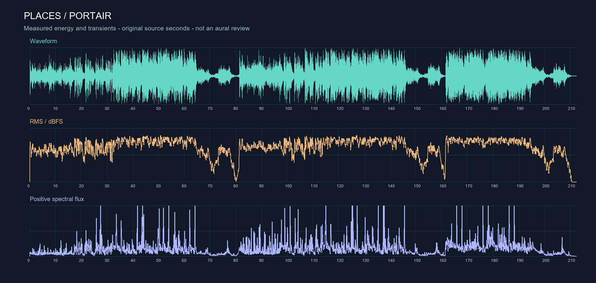

# 音乐分析与90秒结构小样 v1

## 已知来源

- 用户提供：`../../bgm/dc39D5yN-Places-Portair.mp3`。
- 文件内嵌标签：歌曲 `Places`，艺人 `Portair`，专辑 `Places`。这些是文件提供的元数据，尚未外部核验具体发行/混音版本。
- 已获准截取部分并混音。原始 MP3 保留不变。
- 基础信息输出：`analysis/source_audio.json`；生成工具：`tools/inspect_mp3.py`。

## 基础检查结果

| 项目 | 结果 |
| --- | --- |
| 文件大小 | 8,499,414 字节 |
| MP3 帧累计时长 | 212.480 秒，约 3 分 32.48 秒 |
| 编码信息 | 44,100 Hz；双声道；所扫描帧均为 320 kbps |
| 帧数 | 8,134 |
| 帧扫描结果 | 跳过 ID3 标签后无未解析/重新同步字节 |
| SHA-256 | `4e2e8b4f5bf670d2acfcf97cf40d37c128bb0195871c8f073cf73e0cc8fecc0a` |

时长由 MP3 帧头累计得出，未扣除编码延迟/填充，最终精确剪辑点以解码音频和剪辑工程为准。

## 实际完成的分析

已使用本地音频解码器读取音乐样本，并测量RMS能量、频谱与瞬态变化。解码后时长为 **212.416145秒**，与帧头累计时长的微小差异来自编码填充/解码处理。分镜和小样统一使用这次解码的起点。

数据见 [audio_structure.json](analysis/audio_structure.json)，工具见 [analyze_signal.py](tools/analyze_signal.py)。

| 原曲约略区间 | 测得的变化 | 可承担的故事功能（创作判断） |
| --- | --- | --- |
| 0–16秒 | 4秒窗单声道RMS约−20到−19dBFS，能量较低 | 更长版本可作开场；90秒版先省去 |
| 16–32秒 | 能量与高频活动上升，RMS约−19到−16dBFS | 建立自拍任务，开始移动 |
| 32–64秒 | RMS约−13到−11dBFS，较连续的高能量段 | 追赶与跨地点剪辑 |
| 64–80秒 | 明显回落，部分窗口约−27到−21dBFS | 停住、呼吸与松手 |
| 80–144秒 | 再发展并回到较高能量 | 90秒版跳过，避免结构过长 |
| 144–160秒 | 第二次明显回落 | 作为其他混音版本的可选连接区 |
| 160–192秒 | 再次抬升，后段瞬态较密 | 取前16秒表现松弛后的释放 |
| 192秒后 | 能量退去，保留一些小幅波动后收束 | 最终11秒长镜头的余韵 |

这些是测量分区，边界写“约”，不等同于已试听确认的主歌、副歌、乐句或某种乐器。算法得到约58.7/117.5等周期候选，存在半速/倍速和其他周期解释，**暂不把它锁成BPM或重拍网格**。

## 90秒取段方案

所有片段来自同一个用户原始MP3；不变速，三段无时间重叠。时间单位为解码后秒。

| ID | 成片入–出 | 原曲入–出 | 时长 | 处理 | 叙事作用 |
| --- | --- | --- | ---: | --- | --- |
| M01 | 0.000–64.000 | 16.000–80.000 | 64秒 | 开头0.16秒淡入，尾部0.08秒淡出；其余保留原曲连续顺序 | 准备→追赶→原曲自己回落，避免在呼吸段强造静音 |
| M02 | 64.000–80.000 | 160.000–176.000 | 16秒 | 0.08秒淡入、0.12秒淡出 | 先低后起，约66秒进入大景 |
| M03 | 80.000–90.000 | 202.400–212.400 | 10秒 | 0.12秒淡入、末尾0.8秒淡出 | 落入最终固定镜头，让结尾有时间 |

淡入淡出仅用于端点控制，不代表乐句衔接已经通过试听。整体约−2dB增益留出空间，无人声分离、无额外配乐。

### 试听小样

[播放/下载90秒音乐结构小样](audio/places_90s_structure_v1.mp3)

**小样只包含音乐取段，不含现场声、自拍提示音、快门或旁白。** 实际成片需加入下一节的声音设计，尤其48–64秒的呼吸与风。

目前没有完成耳听复核。请重点核对：开头是否截在人声中间、64秒重新进入是否顺畅、80秒转尾段是否切断一句演唱。若有问题，先在对应源区间前后找完整乐句，再按总长90秒重分镜头；不靠加长交叉淡化掩盖人声叠句。最后11秒镜头尽量保留。

## 声音导演表

| 成片位置 | 声音动作 | 与音乐关系 |
| --- | --- | --- |
| 0–10秒 | 第一轮轻短自拍提示；10秒快门 | 音量只够建立任务，保留音乐进入 |
| 18–28秒 | 第二轮提示；28秒快门 | 可以只留少数声，避免机械音抢走整段音乐 |
| 36–46秒 | 第三轮提示；46秒快门 | 越靠近转身未完成的照片，提示音越显得催促 |
| 48–56秒 | 一次完整呼吸、近处衣料和真实风 | 让原曲低处有具体的人；不要把呼吸拉成慢动作 |
| 56–60秒 | 一次录影提示 | 之后自拍滴声消失，变化能被听见 |
| 64–79秒 | 脚步变缓，衣角和轻笑可少量穿过 | 音乐空间打开，但不用每次切镜都配whoosh |
| 79–90秒 | 风在剪辑前先进入，并持续到结束 | 80秒音乐转尾段，最后没有快门打断人物 |

现场素材未拍到之前，不把合成音效描述成真实西北环境录音。声压平衡以最终画面、小音箱和耳机共同检查为准。

## 技术检查与可复现性

- PCM与导出MP3解码后均为90.000秒；25fps视频时间线为2250帧。
- 原曲取段全部落在解码长度内；原始BGM的SHA-256保持不变。
- PCM样本峰值约−1.778dBFS，MP3解码样本峰值约−1.681dBFS；这不是true-peak或LUFS检测。
- 验证报告：[validation_v1.json](analysis/validation_v1.json)。完整剪辑数据：[film_v1.json](analysis/film_v1.json)。
- 可重新运行 [build_film_v1.py](tools/build_film_v1.py) 生成分镜表、音乐小样和校验报告；依赖版本见 [requirements_audio.txt](tools/requirements_audio.txt)。无损中间文件与临时依赖保存在Git忽略的 `tmp/`。
