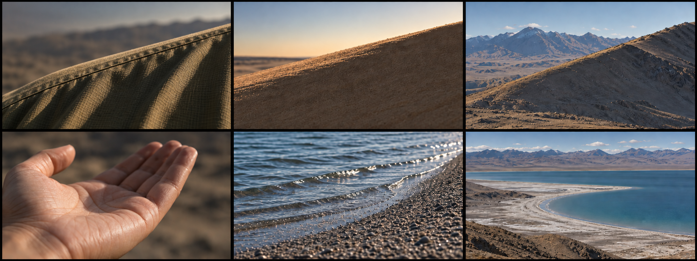
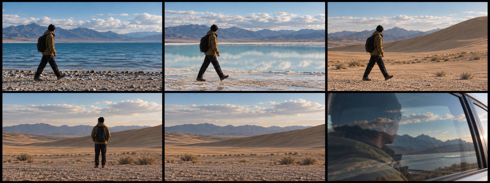

# V2 参考画面与构图意图

两张六格画面板通过内置imagegen生成并以参考图编辑校正，共12格；未调用CLI/API后备。完整画面板约8:3，每格约16:9。它们用于预演气质、色彩和构图关系，不代表实拍地点、用户外貌或某一天的天气。PDF中的矢量小图进一步说明构图和运动方向。

## 材质、形状与尺度

| 位置 | 镜号 | 连接意图 | 现场要点 |
| --- | --- | --- | --- |
| 左上：衣褶 | V2-02 | 先读作贴近身体的布料 | 找清楚的左下到右上主线 |
| 中上：沙脊 | V2-03 | 相同线条发生尺度跳跃 | 亮面与主线位置参考衣褶截图 |
| 右上：山线 | V2-04 | 再扩展为远山，随后回到肩背 | 角度以实际地貌为准，可微调裁切 |
| 左下：手掌 | V2-06 | 触觉意象的起点 | 侧光、自然舒展，不强求极近微距 |
| 中下：水纹 | V2-07 | 纹理开始流动 | 实拍可取更紧的水纹，减少岸边石子干扰 |
| 右下：岸线 | V2-08 / V2-31 | 纹理扩展为地理，再在后段回响 | 航拍与地面宽景均可实现 |

提示词依次为：[初次生成](prompts/montage_v2_materials.txt)、[画幅与配对校正](prompts/montage_v2_materials_refine.txt)、[衣褶主线校正](prompts/montage_v2_materials_final_fix.txt)。最终保留了上排三条主线的一致方向。

## 动作、空缺与回环

| 位置 | 镜号 | 连接意图 | 现场要点 |
| --- | --- | --- | --- |
| 上排湖岸 / 盐地 / 沙地 | V2-12 / 13 / 14 | 同一人、同一方向、同一步跨地点 | 生图展示人物尺度；起、中、落相位需用首站实拍三帧记录，不能照着三个相同姿势切 |
| 左下：人物在场 | V2-20 | 先建立人物位置 | 现稿人物放右侧三分线，图为气质参考 |
| 中下：空景 | V2-21 | 省略离开的过程，产生时间空缺 | 生图两格仅近似同构图；实拍必须同机位连续录制，再在后期省略中间部分 |
| 右下：车窗 | V2-01 / V2-35 | 开头转头未完，结尾接原动作 | 同一条真实素材拆首尾，倒影难拍时改车内侧脸 |

提示词：[初次生成](prompts/montage_v2_presence.txt)、[画幅与人物连续性校正](prompts/montage_v2_presence_refine.txt)。人物、衣服和背包是统一视觉占位；现场沿用自己的装束，只需跨地动作组维持连续。

## 使用与记录

- 采用的原始输出路径、尺寸、SHA-256见[图像清单](analysis/image_manifest_v2.json)。项目中的PNG为原输出直接复制，未用程序改图。
- [完整逐镜稿](07_一瞥_V2_蒙太奇分镜.md)明确画面动作；[配对拍摄单](08_V2_蒙太奇配对拍摄单.md)说明现场对齐方法。
- 参考图描述构图关系，不是必须复刻的地貌、光线与服装。未拿用户照片生成肖像。
