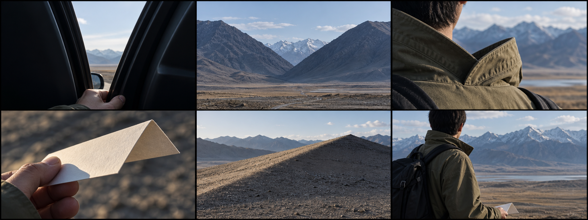
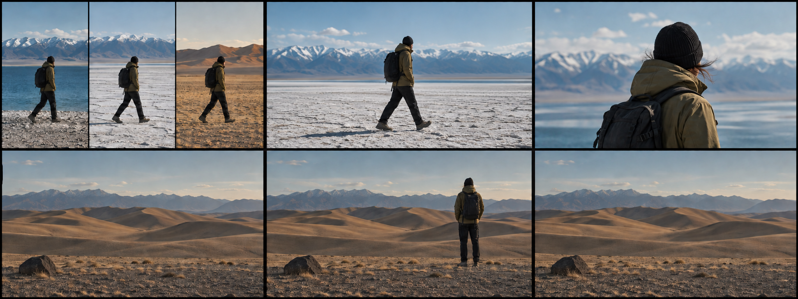
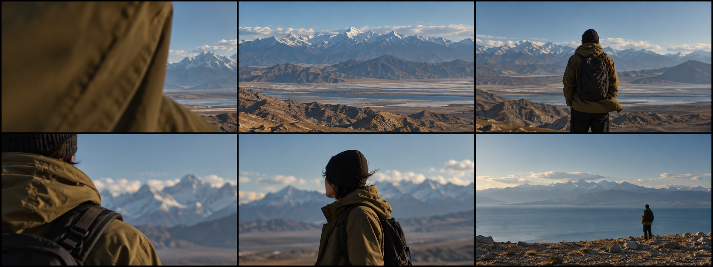
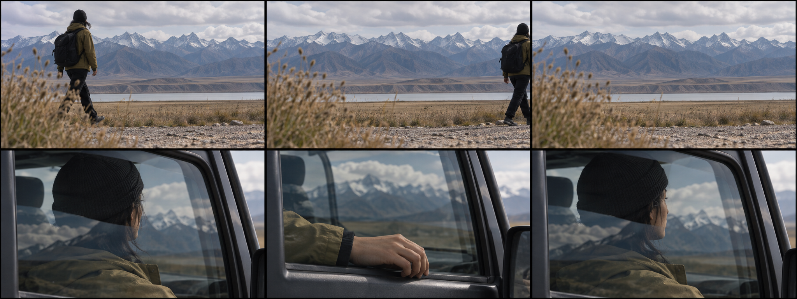

# 《一瞥》V2.1｜参考画面

本轮新增4张六格画面板，共24格，由内置imagegen生成并按需要校正。它们用来帮助判断构图、尺度和镜头并置，人物与地点均为概念占位；没有使用用户肖像。

生成图不能替代动作的真实时间。精确相位、机位位置与连续空景，以[关联分镜](11_V2.1_关联分镜灵感库.md)和现场参考帧为准。不同画面板的占位服装细节可能不同，实际出镜沿用自己的装束并保持同组连续。
## 画面板A · 开口与折线

**上排：**E01：窗缝、山口、衣领。

**下排：**E02：折纸、沙脊、放下纸后的身体。

**拍摄时：**取同方向开口或斜线即可，不需要同一个景点。折纸是可选小道具。

[原始提示词](prompts/v21_board_a.txt)。
## 画面板B · 一个画幅里的不同时间

**上排：**E06：三列分屏、中间画面回到宽幅、稳定人物。

**下排：**E08：空景、人物、再次空景。

**拍摄时：**分屏素材拍完整横屏；下排生成背景近似一致，实拍要求一条固定机位长录。

[原始提示词](prompts/v21_board_b.txt)。
另做了[上排中间人物尺度校正](prompts/v21_board_b_refine.txt)，使分屏回到完整横屏的意图更清楚。
## 画面板C · 从遮挡到开放

**上排：**E09：衣料遮挡、大景展开、衣料回到身体。

**下排：**E10：肩背、自然反应、小人与辽阔。

**拍摄时：**图像只给情绪和尺度方向，衣料运动与人物反应要现场完整拍下。

[原始提示词](prompts/v21_board_c.txt)。
## 画面板D · 离开与回到观看

**上排：**E11：进入、完整走出、连续空景。

**下排：**E12：转头前半、窗边手、同一转头后半。

**拍摄时：**上排三格是一条连续画面；下排首尾必须来自同一真实素材。

[原始提示词](prompts/v21_board_d.txt)。
采用文件的原始输出路径、尺寸与哈希记录在[图像清单](analysis/image_manifest_v21.json)。[上一轮12格参考](09_V2_参考画面.md)继续适用于布料、掌纹、水纹和三地一步。

图像文件从内置工具输出直接复制到项目，没有用程序改动像素。排版里的缩放与图像展示不代表现场必须精确复刻。
