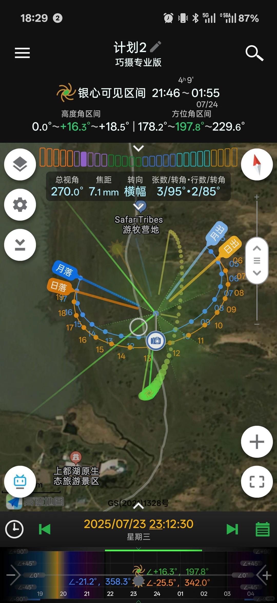
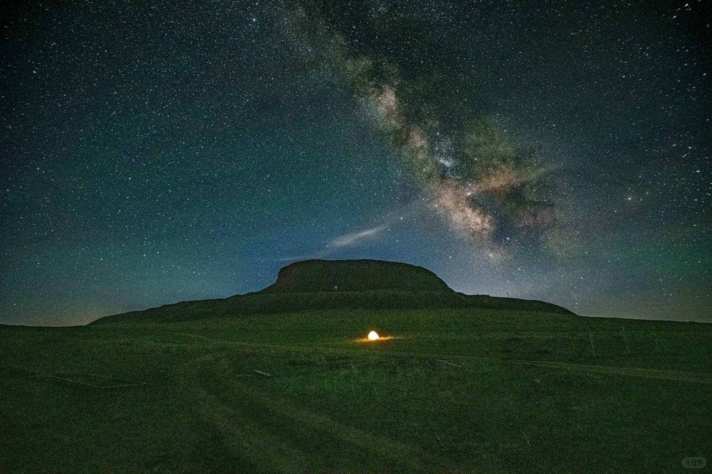
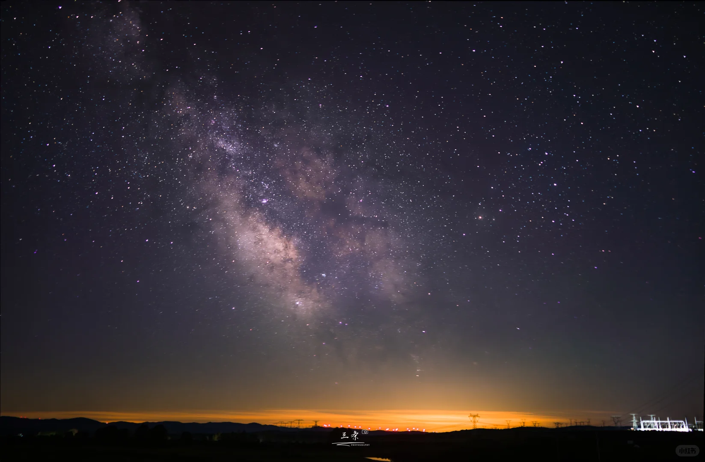
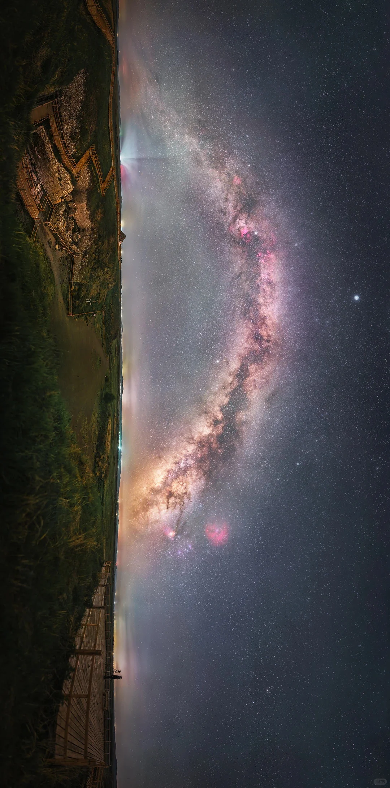
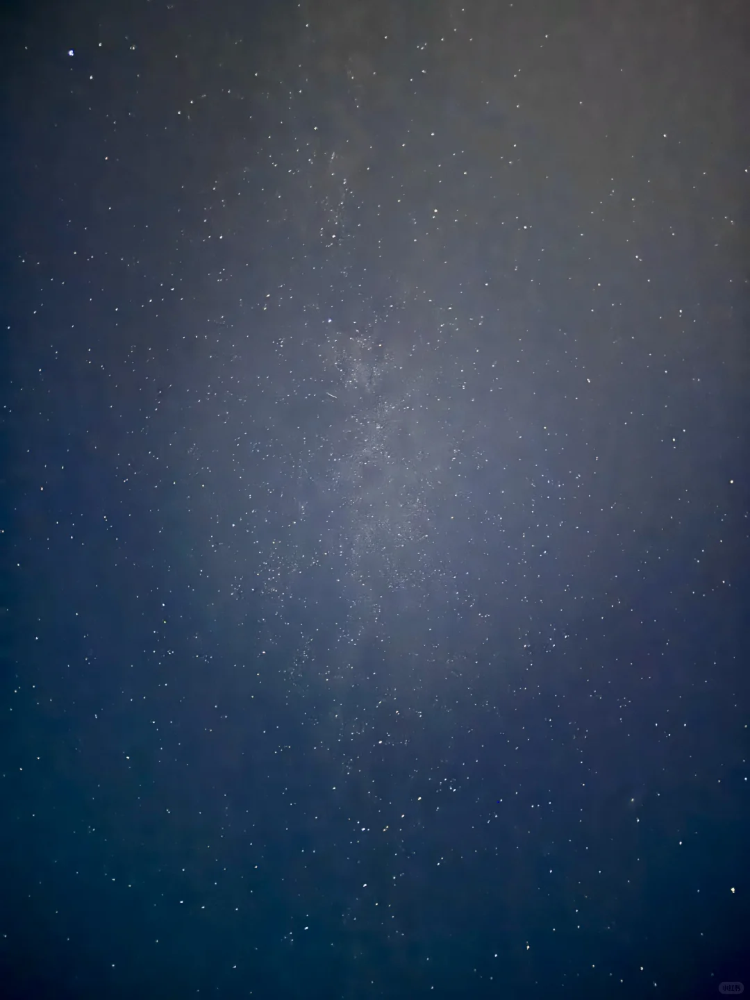
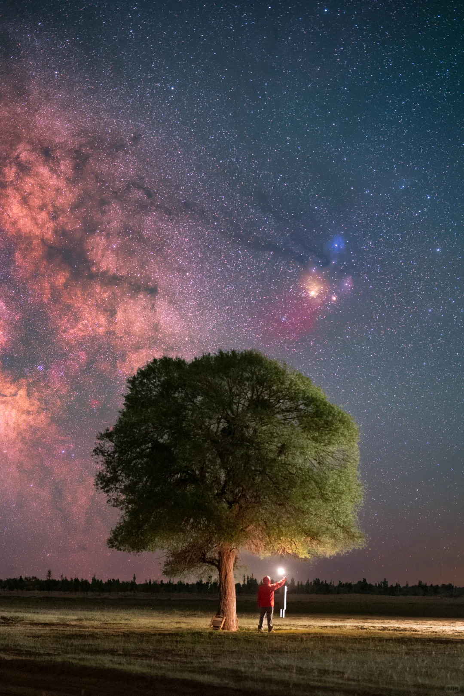
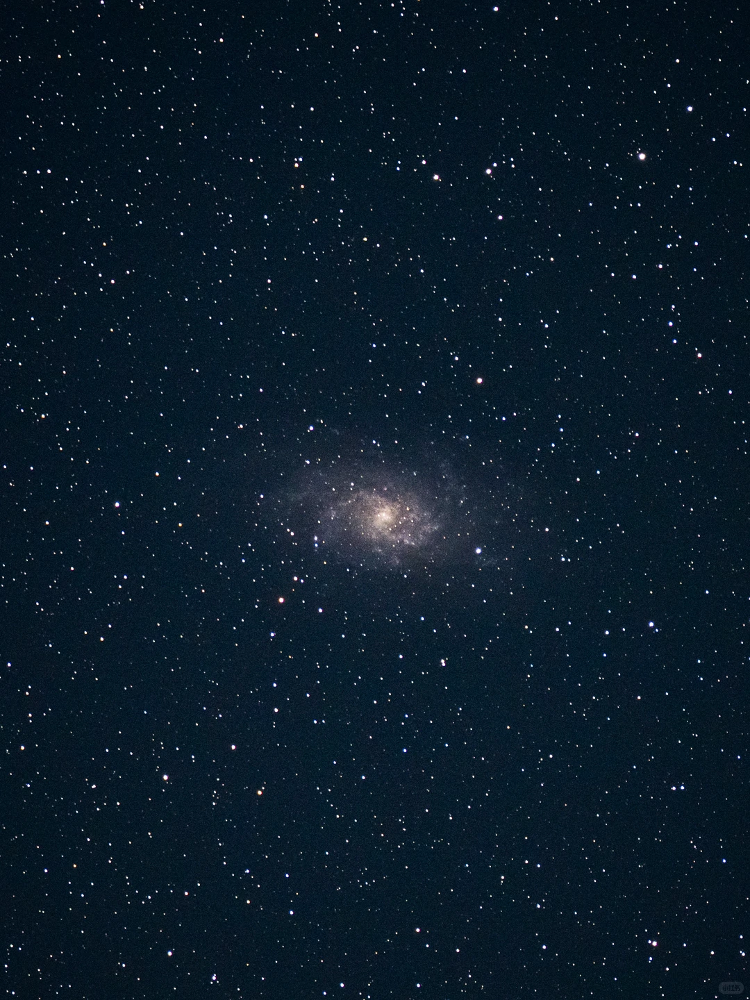
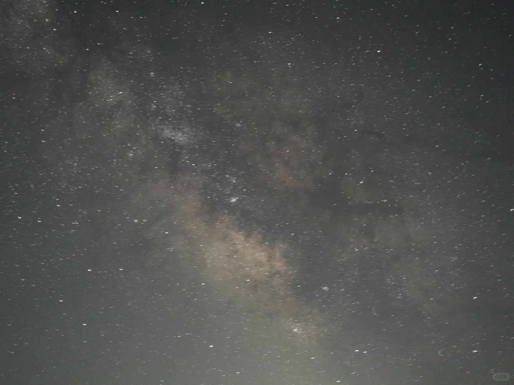
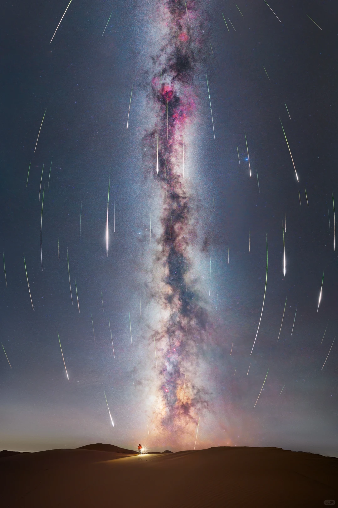

# 2026 英仙座流星雨：北京自驾内蒙古机位调研

更新时间：2026-08-03  
拍摄窗口：2026-08-12 夜间到 2026-08-13 凌晨  
起点假设：北京城区，按天安门附近作为路线基准；实际取车点不同会有浮动。  
坐标说明：下文坐标按高德/GCJ-02 口径记录，导航时建议直接搜地点名。

图片说明：本文图片来自小红书公开笔记下载，仅作个人踩点、构图和路线参考；若后续公开发布、转载或商业使用，请改用原帖链接或征得作者授权。

## 先给结论

如果只看这次 8/12 夜到 8/13 凌晨的综合成功率：

| 排名 | 方案 | 车程 | 天气窗口 | 前景 | 光污染 | 执行难度 | 结论 |
|---|---:|---:|---:|---:|---:|---:|---|
| 1 | 上都湖 + 元上都/多伦湖联动 | 约 5.7-6.0h | 平均云量约 19%，整夜 7-30% | 湖岸、敖包、孤树、草原路 | 约 Bortle 2-3，按机位浮动 | 中 | 最均衡，主推 |
| 2 | 乌兰哈达火山/G208 北向 | 约 4.8h | 平均云量约 12%，前半夜几乎无云 | 火山锥、草原路、风机 | 暗夜保护区加分，但热门点有灯 | 低-中 | 最近、天气最好，稳妥主推 |
| 3 | 多伦湖/滦河湖观景平台 | 约 5.2h | 平均云量约 16%，后半夜云增多 | 湖岸、观景台、草原湿地 | 约 Bortle 3-4 | 低 | 适合当上都湖南侧备份 |
| 4 | 乌拉盖九曲湾/乌拉盖湖 | 约 11-12h | 平均云量约 6%，但晚间阵风可到 45km/h | 河湾、草原、湖面 | 约 Bortle 1-2 | 高 | 天气和暗夜都强，时间成本太高 |
| 5 | 库布齐七星湖/07 沙漠公路 | 约 8.6h | 平均云量约 35%，午夜后云增多 | 沙丘、孤树、公路 | 约 Bortle 2-3 | 中-高 | 沙漠前景漂亮，但这晚不如上都湖稳 |
| 6 | 辉腾锡勒/黄花沟 | 约 5.1h | 平均云量约 58%，午夜后明显转差 | 草原、风机、山梁 | 约 Bortle 4 左右 | 低 | 只做临场转晴备选 |
| 7 | 达里湖/达达线/阿斯哈图 | 约 7-8.5h | 平均云量约 68-77% | 湖、草原公路、石林 | 约 Bortle 2-3 | 中-高 | 地景好，但本次天气不配合 |
| 8 | 腾格里/月亮湖/阿拉善 | 约 14h，或飞银川再租车 | 平均云量约 62%，风大 | 沙丘、沙漠公路 | 约 Bortle 1-2 | 高 | 暗夜顶级，但不适合作为北京租车首选 |

我的建议：

1. 首选做 `上都湖 2 天 1 夜`，把元上都、多伦湖都当作半小时到 1.5 小时内的机动备份。这个方案的地景、天气、车程、住宿都比较平衡。
2. 如果想更稳更近，做 `乌兰哈达 1-2 天`，晚上避开热门火山口和营地灯，往 G208 北向或暗夜保护区方向找低灯位。
3. 如果你能请假、能接受 12 小时车程，`乌拉盖`是本次天气最漂亮的远程冲刺方案，但更像三天两夜，不适合只为一个晚上硬刚。

## 天象与相机建议

国际流星组织 IMO 的 2026 页面显示，英仙座活跃期为 7 月 17 日至 8 月 24 日，2026 年峰值夜为 8 月 12-13 日，ZHR 约 100，辐射点约 RA 03:12、Dec +58.1，速度约 59km/s；该夜月亮约 0%，条件非常好。北京的月相资料显示，2026-08-13 01:36 新月；8 月 12 日月落约 19:05，8 月 13 日月升约 05:39，所以主拍窗口基本无月光干扰。

16mm f/1.8 很适合这次。拍流星建议不要只追银河中心，流星来自英仙座辐射点，但会划过全天空：  
如果想拍“流星从一点放射”的感觉，0:00 后把画面偏北/东北；如果想要更长流星轨迹和银河、地景同框，画面可偏南、东南或西南，避开辐射点 40-90 度更容易出现长线。

建议参数：

| 用途 | 全画幅 16mm f/1.8 | APS-C 16mm f/1.8 | 备注 |
|---|---|---|---|
| 流星连续拍 | f/1.8，8-13s，ISO 3200-6400 | f/1.8，6-10s，ISO 6400 起试 | 间隔 1s，RAW，连拍 3-5 小时 |
| 银河单张 | f/1.8，10-15s，ISO 1600-3200 | f/1.8，8-10s，ISO 3200 | 星点优先，别迷信 500 法则 |
| 前景补光 | 低亮暖光 1-2s 扫过 | 同左 | 不要照别人镜头，尤其热门点 |
| 后期素材 | 天空连续片 + 单独前景 | 同左 | 关闭长曝降噪，避免相机每张黑场卡时间 |

装备重点：三脚架、快门线/间隔拍、至少 2-3 块电池或外接供电、头灯红光模式、防露带/暖宝宝、保暖外套、露营椅、纸巾/镜头布。湖边和草地露水会很重，沙漠则注意风沙。

## 方案 A：上都湖 + 元上都 + 多伦湖，综合首选

### 地理位置与车程

- 目标点：上都湖原生态旅游景区，约 `116.262055,42.599649`
- 参考机位 1：上都湖东南方向敖包/湖岸路边，小红书图示在 SafariTribes 游牧营地与上都湖景区之间的湖东南侧路边。
- 参考机位 2：上都湖北岸孤树/开阔草地，小红书有作者提到环湖后在北岸找到“有树但开阔无遮挡”的位置。
- 参考机位 3：正蓝旗大成培训基地附近，适合找公交车、玻璃房等人工前景，但要确认是否可夜间进入、是否会被管理。
- 北京到上都湖：约 436-447km，约 5.7-6.0h。
- 上都湖到元上都遗址：约 42km，约 0.9h。
- 上都湖到多伦湖：约 90km，约 1.4h。

### 8/12 夜天气

Open-Meteo 2026-08-03 查询，8/12 20:00-8/13 05:00：

- 平均云量：约 19.4%，整夜 7-30%，是本次近程目的地里很稳的一档。
- 逐小时云量：20:00 9%，21:00 7%，22:00 10%，23:00 16%，00:00 23%，01:00 28%，02:00 30%，03:00 28%，04:00 24%，05:00 19%。
- 降水：预测累计 0mm，降水概率平均约 17%，最高约 29%。
- 温度：约 12.8-16.7C；湿度最高约 71%。
- 风：平均约 6.2km/h，阵风最高约 26.3km/h。

判断：非常适合主拍。云量低且没有明显降水，但湖边草地夜里会有露水，镜头防露要准备。

### 周边环境与前景质量

上都湖的核心价值是“草原湖泊 + 敖包 + 孤树 + 遗址文化氛围”。比乌兰哈达更有水面和草原湿地层次，也比多伦湖更偏暗、更野一点。小红书实拍里出现过敖包与银河、湖岸开阔草地、北岸孤树、公交车/玻璃房等构图。

优点：

- 地景比纯草原更丰富，16mm 可以把敖包/孤树/人物压进画面。
- 湖岸开阔，南向/东南向视野容易做银河和流星长线构图。
- 和元上都、多伦湖距离近，天气出问题时有机动空间。

风险：

- 湖边路窄，夜间不要随便掉头或压草地。
- 小红书评论里有人提到夜间湿气、草上露水重，建议穿防水鞋或雨靴。
- 景区/营地附近可能有灯，真正拍摄要离住宿灯源和车灯远一些。

### 推荐机位

1. 上都湖东南敖包位  
   小红书笔记《上都湖机位 | 星夜下的遗迹探索》明确说机位在上都湖东南方向，p5 地图显示在 SafariTribes 游牧营地南侧、上都湖原生态旅游景区北侧之间的路边区域。适合拍“敖包 + 银河/流星 + 人物剪影”。16mm 可以近距离压前景，但要控制补光，不要把敖包照得太硬。

2. 上都湖北岸孤树位  
   小红书笔记《达达线右转上都湖找到超绝银河树》提到环湖后在北岸找到树和开阔无遮挡的视野。这个机位更适合流星雨，因为画面不用拘泥于银河中心，孤树放底部或一侧，天空留足面积。

3. 正蓝旗大成培训基地/公交车玻璃房  
   小红书笔记《打卡上都湖星空机位【含教学】》给出导航“正蓝旗大成培训基地”，路况为高速 + 草原风景大道，所有车型可达。适合新手找明确前景，但人工灯和管理不确定，建议白天先踩点。

### 住宿与餐饮

高德周边 POI 显示：

- 正蓝旗上都湖野奢酒店：在上都湖原生态旅游景区内，离湖很近，最方便；旺季价格和入住时间一定提前电话确认。
- 佈和特色民宿：约 7.8km，双湖旅游度假村方向。
- 草原人家度假村：约 9km，黑风河旅游景区附近。
- 爱马酒店、正蓝旗草原毡房度假村：约 16-21km。

餐饮很 sparse。高德在 20km 内餐厅结果少，能查到正蓝旗五一牧场艺术公社餐厅约 22.7km；更稳是傍晚前在正蓝旗上都镇或桑根达来把正餐吃完，带足水、热饮和夜宵。不要指望 23:00 后湖边还有可靠补给。

### 小红书参考

- [上都湖机位 | 星夜下的遗迹探索](https://www.xiaohongshu.com/explore/69c65f490000000022001266?xsec_token=ABhTyeBPmcv5Vi_5MuU0kfedhapBdvJUrs_gFUT_cAaVc=&xsec_source=)
- [上都湖星空拍摄小结](https://www.xiaohongshu.com/explore/6a3724a400000000110114e6?xsec_token=ABCF03_5n9zmUYS9AvtbcCf0NVxbibdYLisZ5Ax0K0q0o=&xsec_source=)
- [达达线右转上都湖找到超绝银河树](https://www.xiaohongshu.com/explore/6863c462000000000d025186?xsec_token=ABecFdiQUU-1K58kCGVJUg76361G382ILTcujFAabb2r0=&xsec_source=)
- [打卡上都湖星空机位【含教学】](https://www.xiaohongshu.com/explore/685c1896000000000d0252bf?xsec_token=ABi65gfGxg4xacisNiyck_1wpkELIzgcMz2B6txsrg5rE=&xsec_source=)

### 推荐执行

最舒服的安排是 8/12 中午北京出发，傍晚到上都湖附近，先看日落、踩点、吃饭，21:30 后开始架机。主机位选东南敖包或北岸孤树，拍到 02:30；如果云量上来或车灯干扰严重，换到元上都外围合法道路或多伦湖/滦河湖方向。

## 方案 B：乌兰哈达火山/G208 北向，近程稳妥

### 地理位置与车程

- 目标点：乌兰哈达火山地质公园，约 `113.122579,41.555532`
- 北京到乌兰哈达火山：约 422km，约 4.8h；南游客中心约 388km，约 4.5h。
- 重点不是一定站在火山口，而是从火山群向北、向西北避开民宿灯和游客车灯。

### 8/12 夜天气

- 平均云量：约 12%，整夜 0-58%。
- 逐小时云量：20:00 1%，21:00 0%，22:00 0%，23:00 0%，00:00 0%，01:00 0%，02:00 6%，03:00 18%，04:00 37%，05:00 58%。
- 降水：预测累计 0mm，降水概率平均约 12%，最高约 24%。
- 温度：约 14.0-18.9C。
- 风：平均约 3.4km/h，阵风最高约 21.2km/h。

判断：天气是近程点里最强的，尤其 20:00-02:00 很漂亮；缺点是后半夜云量开始增加，且热门火山口人车灯干扰大。

### 周边环境与前景质量

乌兰哈达的地景识别度很高：火山锥、火山石、草原、风电机组、路面线条都能成为前景。中新网内蒙古新闻 2026-04-10 报道称，乌兰哈达火山暗夜保护区位于火山群西北约 10km，海拔约 1500m，低光污染、视野开阔，是距离北京很近的暗夜观星区域。这对本次非常加分。

优点：

- 北京出发最近，开车压力最低。
- 官方暗夜保护区落地，找低光环境更容易。
- 天气预报很给力，前半夜几乎无云。
- 住宿、餐厅比上都湖更密集，后勤好。

风险：

- 5/6 号火山、宇航员打卡点、热门营地会有大量游客、头灯、车灯。
- 火山石路面夜间容易崴脚，山口风大。
- 火山口构图容易撞片；真正高质量要远离灯源，提前白天踩点。

### 推荐机位

1. G208 北向暗处  
   小红书笔记《乌兰察布G208银河有迹可循》提到凌晨从火山民宿出发，沿察右后旗 G208 一路向北，找无灯位置拍摄，时间集中在凌晨 2-4 点。这个思路很适合避开热门火山点：先把车停在安全路肩或空地，不挡路、不进草场。

2. 火山 5 号/6 号外围  
   小红书笔记《乌兰哈达的银河》展示过 5 号、6 号火山星空。适合把火山锥做剪影，但尽量不要在游客最多的主入口旁拍，车灯会毁片。

3. 星河计划观星营地/暗夜保护区周边  
   小红书新手观星笔记提到过星剧场、观星讲解、半夜出门拍银河。这个点适合新手：可以住得近，夜里少开车，但要问清楚营地灯光管理和拍摄区域。

### 住宿与餐饮

高德周边 POI 很多：

- 乌兰察布火山草原自驾营地、白音格勒露营地、牧野星辰民宿、牧野星空民宿、伴山渡火山民宿、塔拉宿集·星院民宿：多在火山群 3-4km 范围。
- 餐饮可查到伴山渡火山餐厅、达延汗餐厅、火山印迹餐厅、乌兰哈达火山 41 度餐厅、山语星辰火山特色餐厅、南游客餐厅等。

建议住宿选靠近火山但不要正对强灯的民宿；拍摄前问老板哪里少灯、哪里夜里车少。晚饭在住宿或白音察干镇解决，夜里带热水和干粮。

### 小红书参考

- [乌兰察布G208银河有迹可循](https://www.xiaohongshu.com/explore/6a683c07000000000100d882?xsec_token=ABDXjml1YHH8K9R986h0HwCfDM7cZTkYJzEvDPFEKu8xo=&xsec_source=)
- [来，看银河！乌兰哈达火山新手小白观星拍摄](https://www.xiaohongshu.com/explore/6a56d9f9000000000702cdcc?xsec_token=ABehBudJZQJdLJqnsoYA1nVFpGIEkhJGi18Xm6KkBKF-A=&xsec_source=)
- [乌兰哈达的银河](https://www.xiaohongshu.com/explore/6a320007000000001003e874?xsec_token=ABrPzTjloagq3bDDx9w1t6AagqX6DKZScVKRBXmyUCpYM=&xsec_source=)

### 推荐执行

如果你只请 1 天或不想疲劳驾驶，乌兰哈达是最稳选择。8/12 下午到，日落前看 5/6 号火山外围、G208 北向路边和营地周边暗处；21:30-02:00 主拍，02:00 后如果云量增加就收机回住处。不要把主机位压在火山口游客核心区。

## 方案 C：多伦湖/滦河湖观景平台，上都湖备份点

### 地理位置与车程

- 目标点：多伦湖景区，约 `116.660941,42.197453`
- 北京到多伦湖：约 405km，约 5.2h。
- 上都湖到多伦湖：约 90km，约 1.4h。
- 可联动：鲸鱼岛日落、多伦湖湖岸、滦河湖观景平台、鱼儿山镇/天之尽头方向。

### 8/12 夜天气

- 平均云量：约 15.8%，整夜 6-44%。
- 逐小时云量：20:00 16%，21:00 11%，22:00 8%，23:00 6%，00:00 6%，01:00 8%，02:00 11%，03:00 18%，04:00 30%，05:00 44%。
- 降水：预测累计 0mm，降水概率平均约 21.5%，最高约 31%。
- 温度：约 11.9-16.4C；湿度最高约 79%。
- 风：平均约 3.3km/h，阵风最高约 27.7km/h。

判断：天气很不错，但湿度高、后半夜云量增加。作为上都湖备份非常合适。

### 周边环境与前景质量

多伦湖优势是后勤成熟、湖岸开阔、住宿餐饮多；缺点是前景不一定强，小红书作者也提到湖边“开阔但前景一般”，且道路车灯会影响延时。它更适合作为“稳妥备份”而非最有审美上限的主机位。

### 推荐机位

1. 鲸鱼岛/多伦湖湖岸  
   适合先拍日落，再沿湖岸找开阔位置。避开道路正对镜头的角度，否则车灯会频繁扫进画面。

2. 滦河湖观景平台  
   小红书笔记《北京出发，草原日出日落星空全家桶》提到这里适合看日落和露营，周六夜人少。可作为多伦湖云多时的机动点。

3. 鱼儿山镇/天之尽头方向  
   同一笔记提到，多伦湖云多时往鱼儿山镇、天之尽头方向找更暗区域，看到了流星。这里更偏野，夜路要谨慎，不建议临时开进未知土路。

### 住宿与餐饮

高德周边 POI：

- 住宿：多伦京北草原天湖假日酒店、多伦碧水山居酒店、多伦湖滦源阁农家院、多伦湖畔人家民宿、福鑫源饭店宾馆等。
- 餐饮：福临苑二店餐厅、宝居林快餐厅、赵姐蒙味餐馆、印象餐厅、赛音蒙式茶餐厅、丰悦餐馆等。

多伦县城补给明显比上都湖强。如果走上都湖主线，建议白天把多伦湖作为备份路线，而不是深夜临时长距离折返。

### 小红书参考

- [端午多伦湖追星](https://www.xiaohongshu.com/explore/6a4a46b9000000002201b652?xsec_token=ABhAJeQMV4mROqo5EAhvF56V_VEMGlkojzwOa-VdML6Eo=&xsec_source=)
- [北京出发，草原日出日落星空全家桶](https://www.xiaohongshu.com/explore/6a5ebacc000000001101c59f?xsec_token=ABrjePFLosJRj3z6DF4i7-qtd3TaopwvXW-V1p5oPBjqc=&xsec_source=)
- [北京自驾｜在多伦越野，捡玛瑙，拍银河](https://www.xiaohongshu.com/explore/6a36b0f80000000022019157?xsec_token=ABaN8s9W1WPt6UlapbA-Y18MHgDMsVpuKz94ols74rqnU=&xsec_source=)

## 方案 D：元上都遗址，文化前景很强但要注意合规

### 地理位置与车程

- 目标点：元上都遗址，约 `116.186575,42.361721`
- 北京到元上都：约 403km，约 5.2h。
- 元上都到上都湖：约 42km，约 0.9h。

UNESCO 资料显示，元上都遗址是忽必烈 1256 年建都相关的草原都城遗址，面积约 25,000ha，包含城址、宫殿、寺庙、墓葬、水利遗迹等，2012 年列入世界遗产。作为前景，它的文化辨识度非常强。

### 8/12 夜天气

- 平均云量：约 30.9%，整夜 6-51%。
- 逐小时云量：20:00 6%，21:00 8%，22:00 16%，23:00 27%，00:00 39%，01:00 48%，02:00 51%，03:00 47%，04:00 39%，05:00 28%。
- 降水：预测累计 0mm，降水概率平均约 17.4%。
- 温度：约 12.6-16.5C。
- 风：平均约 3.3km/h，阵风最高约 22.3km/h。

判断：前半夜可拍，午夜后云量偏高。更适合作为上都湖附近的“文化前景备份/补拍点”。

### 机位与注意事项

小红书有摄影笔记在“穆清阁旁”拍过遗址星空，证明地景潜力很高。但这里是世界文化遗产，不建议夜间擅自进入围栏、遗址本体或管理区。更稳妥的做法是：

- 白天先到游客中心确认夜间是否开放、是否允许摄影。
- 没有明确许可时，只在外围合法道路、停车区域、远距离机位取景。
- 不踩踏遗址、不翻越围栏、不使用强补光照射文物。

### 住宿与餐饮

高德周边 POI：

- 住宿：上都驿站、正蓝旗五一种畜场碧海家园民宿、牧场宾馆、正蓝旗草原毡房度假村；上都镇还有汇力商务宾馆、阿都沁游牧文化酒店、正蓝旗上都镇远方酒店等。
- 餐饮：正蓝旗五一牧场艺术公社餐厅约 4.9km；上都镇方向有九韵音乐餐厅、王家餐馆、可汗塔拉蒙餐等。

### 小红书参考

- [星空下的元上都遗址](https://www.xiaohongshu.com/explore/6a3e556d0000000007012814?xsec_token=ABWeBbVKEep5MrNPIboGAgPiKurUxYv5KowHib2Oeb5_Q=&xsec_source=)
- [元上都遗址：跨越时空的对话](https://www.xiaohongshu.com/explore/6841a8ee000000001200098e?xsec_token=AB15e4ugEPwEndua98yOh7K2M5-ltzjaJ86gPJJxnHO6w=&xsec_source=)

## 方案 E：乌拉盖九曲湾/乌拉盖湖，远程暗夜冲刺

### 地理位置与车程

- 目标点：乌拉盖九曲湾景区，约 `119.628760,45.891933`
- 北京到九曲湾：约 985km，约 12.1h；北京到乌拉盖管理区约 913km，约 11h。
- 适合行程：至少 3 天 2 夜；单晚往返不建议。

### 8/12 夜天气

- 平均云量：约 6.3%，整夜 0-10%，是所有候选里云量最漂亮的。
- 降水：预测累计 0mm，降水概率平均约 12%。
- 温度：约 12.5-17.4C。
- 风：平均约 8.1km/h，阵风最高约 45km/h，20:00-22:00 风很猛，三脚架要压稳。

判断：如果只看天空，乌拉盖很诱人；如果看北京租车执行，这个方案太远。更像“请假专门追星”的路线。

### 周边环境与前景质量

九曲湾的河曲、草原和观景台很适合大场景，乌拉盖湖西北方向也有小红书作者提到肉眼银河明显、从管理区约 10 分钟可到。它的优势是暗、开阔、游客密度相对低；劣势是远、风大、夜路长、补给不如近程成熟。

### 机位

1. 九曲湾官方观景台/木栈道中段  
   白天拍河湾，夜里可找开阔天空。但景区夜间交通和摆渡车要提前问。

2. 索林淖尔东岸/景区外开阔位  
   小红书攻略提到有免费视角，适合不想被景区灯和人流影响时找机位。

3. 乌拉盖湖西北方向  
   小红书笔记《6.21 乌拉盖湖银河》提到从乌拉盖管理区凌晨出发约 10 分钟到湖西北方向，肉眼银河清晰。可作为住管理区时的低门槛机位。

### 住宿与餐饮

高德周边 POI：

- 住宿：九曲弯沿河度假民宿、东乌旗乞颜部落蒙古包、星空九宿、九曲秘境·银河民宿、云尚元野草原旅游度假酒店等。
- 餐饮：诺图阁餐厅约 13.4km，串意十足音乐烤吧约 16.4km；实际建议晚餐在乌拉盖管理区或住宿处预订。

小红书九曲秘境银河民宿笔记提到，景区内住宿可看日落和星空，但接驳车少，要提前安排行程。旺季一定提前确认入住、晚餐和夜间出入。

### 小红书参考

- [今夜银河落头顶](https://www.xiaohongshu.com/explore/6a694495000000000c015e86?xsec_token=AB6kw3oQMqdbaZxo4VOlWQddQHCiS0FtOKA3iVrrmu80Q=&xsec_source=)
- [住进草原星空里｜九曲秘境银河星空宿](https://www.xiaohongshu.com/explore/688f099d00000000250104e4?xsec_token=ABxI7usvBQqMgbBVZWekxsRurPWJYx_IMc0dDxJvSO7EE=&xsec_source=)
- [6.21乌拉盖湖银河（肉眼超清晰版）](https://www.xiaohongshu.com/explore/6a36c5b8000000002100a472?xsec_token=ABaN8s9W1WPt6UlapbA-Y18GqdVd6JiPZ3zT8APr6w87c=&xsec_source=)
- [乌拉盖九曲湾攻略](https://www.xiaohongshu.com/explore/689677ef0000000003024067?xsec_token=ABkcXHX4Foe15av0q0SFqPvV3GSBaIL4N5YYuD6kOlrzE=&xsec_source=)

## 方案 F：库布齐七星湖/07 沙漠公路，沙漠前景备选

### 地理位置与车程

- 目标点：七星湖沙漠生态旅游区，约 `108.345138,40.655115`
- 北京到七星湖：约 810km，约 8.6h。
- 相关机位：七星湖“孤独的一棵树”、库布齐 07 沙漠公路、库布齐那日沙/牧民旧居附近。

### 8/12 夜天气

- 平均云量：约 34.7%，整夜 0-59%。
- 逐小时云量：20:00 0%，21:00 2%，22:00 12%，23:00 26%，00:00 41%，01:00 53%，02:00 59%，03:00 58%，04:00 52%，05:00 44%。
- 降水：预测累计 0mm，降水概率平均约 4.5%。
- 温度：约 23.3-30.5C，很热。
- 风：平均约 15.3km/h，阵风最高约 25.6km/h，注意沙尘和镜头。

判断：前半夜很可拍，午夜后云量升高。沙漠地景非常强，但车程和风沙成本高。

### 周边环境与前景质量

库布齐的优势是沙丘、孤树、公路线条，流星雨照片的氛围感很强。小红书有“七星湖孤独的一棵树”“库布齐 07 沙漠公路”“库布齐那日沙/牧民旧居附近”的机位线索。

风险：

- 沙地夜间辨路难，普通租车不要开进未知沙地。
- 景区酒店和游客灯会影响局部天空。
- 风沙会伤镜头和传感器，换镜头要克制。

### 住宿与餐饮

高德周边 POI：

- 住宿：七星湖沙漠酒店、杭锦旗绿色七星湖民宿、雅馨民宿、杭锦旗七星湖宾馆、布拉格民宿、沙韵民宿等。
- 餐饮很少：高德周边可查到恒盛兴沙漠酒店-餐厅约 36km；更稳是独贵塔拉镇、杭锦旗或酒店内解决。

### 小红书参考

- [库布齐沙漠的银河](https://www.xiaohongshu.com/explore/6864ae6e000000002001ac78?xsec_token=ABrcQlMx_JfODOLVEEC_wtV6bI91PKYze6cdLVgHFM78k=&xsec_source=)
- [被这颗树的银河，硬控了！](https://www.xiaohongshu.com/explore/6a3d3d0400000000150251e7?xsec_token=ABes1To9-oGN1XtHrgMijCjDa9956L5oYY4xo_PsVzbsM=&xsec_source=)
- [库布齐07号沙漠公路观星](https://www.xiaohongshu.com/explore/68add082000000001c01273f?xsec_token=ABXd1V9EKXv_bDW0Fhju_IMlp7QYwz3yJnR6aNIdfsTaM=&xsec_source=)
- [我在鄂尔多斯七星湖沙漠拍到了人生照片](https://www.xiaohongshu.com/explore/68e3b694000000000302f44a?xsec_token=ABEGXPPyeMXnscm-mc2gtgsjrJ-cUjuKbmrRYhcwe3VsY=&xsec_source=)

## 方案 G：辉腾锡勒/黄花沟，短途但本次天气不优

### 地理位置与车程

- 目标点：辉腾锡勒黄花沟，约 `112.537638,41.130892`
- 北京到黄花沟：约 415km，约 5.1h。

### 8/12 夜天气

- 平均云量：约 58.5%，整夜 2-92%。
- 20:00-22:00 还行，23:00 后云量快速上升，02:00 约 92%。
- 降水：预测累计 0mm。
- 温度：约 13.7-15.1C。

判断：如果只是看距离，它很诱人；但本次核心时段云量太差，不建议作为首选。

### 周边环境与前景质量

辉腾锡勒有草原、山梁、风机、黄花沟地貌，白天旅行体验强。但小红书多条星空笔记反馈民宿附近灯光明显、银河不够清晰，且黄花沟离城镇/景区灯不算远。它可以是“前 48 小时天气突然变好”的近程候补。

### 住宿与餐饮

高德周边 POI：

- 住宿：黄花沟酒店服务中心、尊享草原度假酒店、察哈尔部落、乌兰察布蒙古包民宿、辉腾锡勒黄花驿站、辉腾部落民宿等。
- 餐饮：黄花餐厅、安达蒙餐厅、辉腾锡勒牧牧餐厅、辉腾锡勒鸿骏度假中心餐厅、林家小院等。

### 小红书参考

- [在辉腾锡勒拍到了银河](https://www.xiaohongshu.com/explore/6a3a37920000000017009c7b?xsec_token=AB8e4vofBS2OrN2od-v4ciLVky90BOrJMjprziqBkalEo=&xsec_source=)
- [乌兰察布追银河 | 赴一场星空之约](https://www.xiaohongshu.com/explore/6a53d683000000001101b245?xsec_token=ABeappr2Mm7o6fhgvvS0BOuvZGPYLaKHcr2vDIjWvsEuo=&xsec_source=)
- [辉腾锡勒草原 夕阳VS银河 位置及参数分享](https://www.xiaohongshu.com/explore/648519c100000000270283be?xsec_token=ABEpRtpbn-fKIQPj9J0RGFOET9ZPmJz4PlPnpJkKVTz20=&xsec_source=)

## 方案 H：达里湖/达达线/阿斯哈图，地景好但本次天气差

### 地理位置与车程

- 达里湖景区：约 `116.751105,43.245061`，北京约 652km，约 7.1h。
- 阿斯哈图石林：约 `117.524483,43.962185`，北京约 719km，约 8.4h。

### 8/12 夜天气

达里湖：

- 平均云量约 76.9%，整夜 59-100%。
- 温度约 13.7-19.1C。
- 降水预测 0mm，但高云厚，星空成功率低。

阿斯哈图石林：

- 平均云量约 68.4%，整夜 39-96%。
- 阵风最高约 34.9km/h。

判断：这条线的日间风景和地景都好，但不适合这次峰值夜。除非 8/10-8/11 最新云图大幅反转，否则不建议把主力押在这里。

### 周边环境与机位

达达线一马平川，视野开阔；热阿线地形更丰富，有山丘、白桦林、草原道路。小红书里有达里湖、达达线银河实拍，也有人提到多托尔营地关灯后能看银河。缺点是餐饮住宿分散、夜间温度低、路上找补给难。

### 住宿与餐饮

达里湖周边：

- 住宿：达里湖君悦酒店、达里湖南岸星之宿民宿、达里湖达根湖宾馆、达里湖南岸蓝湖宾馆、金杭盖酒店等。
- 餐饮：达里湖度假中心餐厅、弘吉剌餐厅等，选择少。

阿斯哈图周边：

- 住宿：阿斯哈图石林花园酒店、克什克腾旗途乐山庄、悦来民宿、悠途居民宿、奇岩别院民宿等。
- 餐饮：高德近距离餐厅很少，最好在经棚镇、热水塘或住处提前解决。

### 小红书参考

- [达里湖畔草原的星空](https://www.xiaohongshu.com/explore/6a4d18f5000000000702c241?xsec_token=ABk7sZf6f0VPZwu3PKHrMYqzK3Gnbm7Ulu6e-bw3xK4z4=&xsec_source=)
- [今天你看见银河了吗？-达达线 热阿线](https://www.xiaohongshu.com/explore/6a66a60d000000001101359f?xsec_token=AB75rM13TWZ-o-8t2G2t9p6qGBS8ScnAWc7s6KcfmILzg=&xsec_source=)
- [在达达线拍到了银河](https://www.xiaohongshu.com/explore/6a37ebc2000000000702bb71?xsec_token=ABCF03_5n9zmUYS9AvtbcCf58u4t7ve78xs41wuF3DPUg=&xsec_source=)
- [是谁在达达线拍到了银河流星](https://www.xiaohongshu.com/explore/6a38c6a4000000001603d065?xsec_token=ABOayiK99aXYO7dqRWAKXUmEHtWWmWS5RlVy2YEGjHx9c=&xsec_source=)

## 方案 I：腾格里/月亮湖/阿拉善，暗夜强但不适合北京租车本次首选

### 地理位置与车程

- 月亮湖/腾格里沙漠方向：约 `105.156944,38.462514`
- 北京自驾到月亮湖：约 1203km，约 14.2h。
- 更合理方式：飞银川，银川机场/市区租车，再开约 2.5-3h 到阿拉善左旗、月亮湖、敖包湖、太阳湖附近。

### 8/12 夜天气

- 平均云量：约 61.8%，整夜 34-95%，高云为主。
- 降水：预测累计 0mm，降水概率低。
- 温度：约 25.7-31.0C。
- 风：平均约 15.8km/h，阵风最高约 40km/h。

判断：暗夜和沙丘地景绝对强，但这次北京租车出发太远，且 8/12 预报高云偏多、风大，不适合作为主线。

### 周边环境与机位

小红书机位线索主要集中在：

- 月亮湖景区附近，快到月亮湖前看到“直行月亮湖、右转敖包湖”后进入 X759 县道一带，沿线找沙丘前景。
- 阿拉善左旗太阳湖附近、梦想沙漠公路牌附近，适合沙漠公路和沙丘构图。
- 库布齐不同，腾格里更西、更暗，但对车辆、补给、风沙经验要求更高。

### 住宿与餐饮

高德周边 POI：

- 住宿：阿拉善左旗月亮湖沙漠酒店、乌兰湖营地、海骝骐湖沙漠观星酒店、观星酒店、虚极静笃民宿等。
- 餐饮非常分散：华祥餐厅、月红餐厅等距离 40-50km 级别；最好在银川、巴彦浩特或住处解决。

### 小红书参考

- [腾格里沙漠星空机位露营攻略](https://www.xiaohongshu.com/explore/6749904e000000000203a3ab?xsec_token=ABwzI4bm5s2v3ArP8XNqvjhRfkwxjWntJ8YkR8UhL2cJk=&xsec_source=)
- [银川驱车3小时，沙漠拍银河技巧分享](https://www.xiaohongshu.com/explore/69fb04cb000000003503860c?xsec_token=AB_XjD6SXOoeQCfa3iggyZWxocOFfpq_aV-TA71Euyckw=&xsec_source=)
- [西北摄苍穹丨一个人的英仙座流星雨](https://www.xiaohongshu.com/explore/66cc74ab000000001f03de97?xsec_token=ABXiioCu0xbsDQt3aUQXaFi4qKrxALOi4lgf3uwR6JZ6o=&xsec_source=)

额济纳/居延海这次不建议：北京车程约 16h 以上，8 月也不是胡杨季，当前云量预报不占优势。

## 推荐路线组合

### 组合 1：上都湖主线，最推荐

- 8/12 12:00 北京取车出发。
- 18:00 左右到正蓝旗/上都湖，先吃饭、入住或确认住处。
- 19:00-20:30 上都湖东南敖包、北岸孤树、大成培训基地三选二踩点。
- 21:30-02:30 主拍，机位优先级：北岸孤树/东南敖包 > 大成培训基地人工前景。
- 02:30 后看云量和体力；不行就回住处，别疲劳开夜路。
- 8/13 上午补拍元上都或多伦湖，下午返京。

### 组合 2：乌兰哈达近程稳妥线

- 8/12 13:00 北京出发。
- 18:00 前后到白音察干/火山群，入住、吃饭。
- 日落前看 5/6 号火山外围、G208 北向暗处、营地周边。
- 21:30-02:00 主拍，尽量避开游客核心区。
- 02:00 后云量可能上升，按体力决定收机。

### 组合 3：上都湖 + 多伦湖机动线

- 先按上都湖方案执行。
- 若上都湖当天云图突然变差，转多伦湖/滦河湖观景平台。
- 若多伦湖也云多，可向鱼儿山镇/天之尽头方向找开阔低灯区，但只走铺装路和已知路线。

### 组合 4：乌拉盖三天两夜冲刺

- 适合有假期、有副驾、能接受长途驾驶的人。
- 8/11 先开到锡林浩特或乌拉盖管理区附近休息。
- 8/12 白天到九曲湾/乌拉盖湖踩点，夜里主拍。
- 8/13 不要硬返北京，建议分段返程。

## 出发前 48 小时复核清单

1. 云量：同时看 Open-Meteo、Windy/ECMWF、晴天钟或天文通，重点看高云和低云，不只看“晴/多云”。
2. 雷达：8/12 下午查华北、内蒙中部雷达回波，草原局地对流会突然发展。
3. 月亮：本次无月光，重点不是月亮，是云。
4. 路况：确认景区夜间是否封路，草原小路是否积水。
5. 住宿：问清楚最晚入住、能否凌晨进出、停车位置、夜间是否关灯。
6. 补给：晚饭提前解决；车上至少 2L 水/人，热水、巧克力/能量棒、垃圾袋。
7. 安全：不要进私人草场、不要翻围栏、不要把车开进未知草地/沙地；夜间路上注意牲畜和无灯车辆。
8. 拍摄礼仪：红光头灯、低声说话、不用远光扫机位、不在别人镜头前补光。

## 资料来源

- 小红书：本文件各地点下列出的公开笔记，主要用于机位线索、近期游客经验、前景和后勤细节。
- [International Meteor Organization：Meteor Shower Calendar](https://www.imo.net/resources/calendar/2019/)：2026 英仙座活跃期、峰值夜、ZHR、辐射点、月光条件。
- [Timeanddate：北京 2026 年 8 月月出月落/月相](https://www.timeanddate.com/moon/china/beijing?month=8)：确认 2026-08-13 新月及 8/12 夜无月光干扰。
- [Open-Meteo Weather Forecast API](https://open-meteo.com/en/docs)：8/12 20:00-8/13 05:00 逐小时云量、降水、温度、风速。查询时间：2026-08-03。
- 高德地图 Web Service API：北京出发车程、目的地 POI、住宿和餐饮周边检索。查询时间：2026-08-03。
- [中新网内蒙古新闻：华北首个火山暗夜星空保护基地落户乌兰察布](https://www.nmg.chinanews.com.cn/news/20260410/53891.html)：乌兰哈达暗夜保护区信息。
- [UNESCO World Heritage Centre：Site of Xanadu](https://whc.unesco.org/en/list/1389)：元上都遗址背景与世界遗产信息。
- [Light Pollution Map help](https://www.lightpollutionmap.info/help.html)：光污染图层与 Bortle 估计方法参考。文中 Bortle 均为结合公开光污染图和小红书实拍经验的估计值，不等同现场 SQM 实测。
