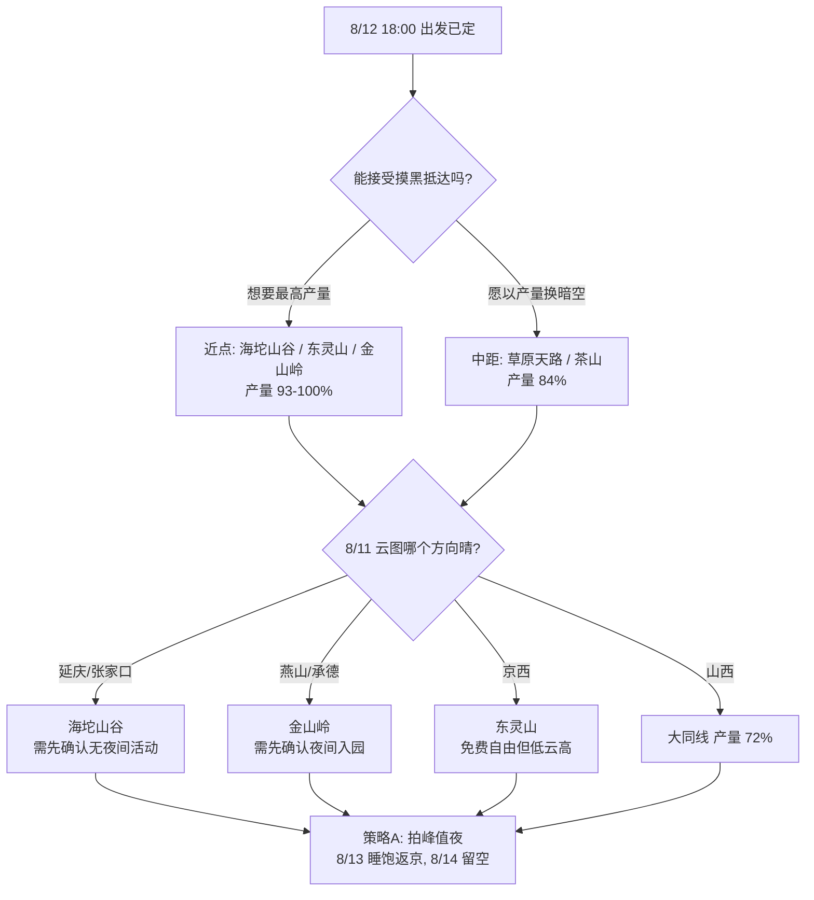

# 2026 英仙座流星雨：40 小时窗口出行方案

更新时间：2026-08-04
时间窗口：**2026-08-12 18:00 出发 → 2026-08-14 10:00 返京，共 40 小时**
出发地：北京城区（按天安门为路线基准）
器材：16mm f/1.8

本文针对 40 小时窗口独立成篇。
另有一份《英仙座流星雨出行方案.md》对应 26.5 小时窗口（8/12 12:30 → 8/13 15:00），两者瓶颈不同、结论不同，不可混用。
机位细节、光污染、小红书线索见三份机位调研文档。

---

## 一、这个窗口的性质

与 26.5 小时窗口相比，是两处方向相反的变化：

| | 26.5h 窗口 | 40h 窗口 | 影响 |
|---|---|---|---|
| 出发 | 8/12 12:30 | 8/12 **18:00** | 晚 5.5h，**白天踩点时间归零** |
| 返程截止 | 8/13 15:00 | 8/14 **10:00** | 多 19h，**返程压力基本消失** |

**总时长变长，但拍摄条件反而变差。** 多出的 19 小时在窗口尾部，被砍掉的 5.5 小时在头部——恰好是日落前的踩点时段。

一句话概括两个窗口的瓶颈差异：

| | 26.5h 窗口 | 40h 窗口 |
|---|---|---|
| 瓶颈 | **返程时间**（睡眠不足） | **出发时间**（无踩点、产量损失） |
| 轮换驾驶价值 | 高，可达半径 2.6h → 4.6h | **低**，返程本就宽松 |
| 内蒙线 | 超窗，不可行 | 可达，但产量腰斩 |

---

## 二、核心矛盾：全部摸黑抵达

8/12 日落约 19:30，天文暗夜约 20:40 开始。18:00 出发意味着无一例外在天黑后抵达：

| 地点 | 单程 | 抵达 | 日落前？ |
|---|---:|---|---|
| 海坨山谷 | 1.9h | 20:23 | ✗ |
| 东灵山 | 1.9h | 20:23 | ✗ |
| 金山岭 | 2.6h | 21:09 | ✗ |
| 草原天路 | 3.7h | 22:22 | ✗ |
| 蔚县茶山 | 3.8h | 22:28 | ✗ |
| 大同火山群 | 4.1h | 22:48 | ✗ |
| 丰宁坝上 | 4.4h | 23:08 | ✗ |
| 大同土林 | 4.6h | 23:21 | ✗ |
| 乌兰哈达 | 5.1h | 23:54 | ✗ |
| 多伦湖 | 5.4h | 00:14 | ✗ |
| 辉腾锡勒 | 5.9h | 00:47 | ✗ |
| 上都湖 | 6.1h | 01:00 | ✗ |

摸黑抵达的代价不只是不便，而是**无法预览地景、判断前景遮挡、确认机位可达性**，只能靠头灯在黑暗中摸索构图。这对夜拍成片率的影响是实质性的。

### 抵达时刻直接决定产量

产量基准仍沿用辐射点高度角模型（21:00-04:30 全窗口 = 100%，约 378 颗理论值）：

| 地点 | 抵达 | 实际开拍 | 产量 |
|---|---|---|---:|
| 海坨山谷 / 东灵山 | 20:23 | 21:00 | **100%** |
| 金山岭 | 21:09 | 21:39 | 93% |
| 草原天路 / 蔚县茶山 | 22:2x | 22:5x | 84% |
| 大同线 / 丰宁坝上 | 23:0x-23:2x | 23:2x-23:5x | 72% |
| 乌兰哈达 / 多伦湖 | 23:54 / 00:14 | 00:2x-00:4x | 58% |
| 辉腾锡勒 / 上都湖 | 00:47 / 01:00 | 01:1x-01:3x | 41% |

**近点优势在这个窗口被显著放大。** 26.5h 窗口里近点赢在"睡得多"，40h 窗口里近点赢在"拍得早"。

---

## 三、三种策略

### 策略 A：主攻第一夜 + 8/13 全天缓冲

只用窗口前 24 小时，8/13 白天睡饱再慢慢返程，8/14 完全不动。

```
8/12  18:00  出发
      20:23-01:00  摸黑抵达（视地点）
      21:00-04:30  连拍（尽早开机）
      05:00  休息
8/13  睡到自然醒 → 12:00 出发 → 下午抵京
8/14  不再出行（窗口未用满，这是余量不是浪费）
```

拍的是 **8/12-13 峰值夜**（ZHR 100）；返程零压力。各点按 12:00 出发的抵京时刻：

| 地点 | 抵京 | 距 8/14 10:00 截止 |
|---|---|---|
| 海坨山谷 / 东灵山 | 14:41 | 余量 19h+ |
| 金山岭 | 15:29 | 余量 18h+ |
| 草原天路 | 16:45 | 余量 17h+ |
| 乌兰哈达 | 18:21 | 余量 15h+ |

全部有巨大余量。**这是本窗口下最稳妥的结构。**

### 策略 B：主攻第二夜（8/13）

第一夜赶路住下，8/13 白天从容踩点，第二夜精拍。

**不推荐，两个原因：**

其一，**8/13-14 夜流量只有峰值的 55-65%**（IMO 活动曲线，峰后一日衰减明显）。用踩点从容换掉近四成流星，不划算。

其二，**8/14 10:00 截止比看起来紧**。第二夜拍到 04:30 再返程，倒推：

| 地点 | 需出发 | 第二夜后可睡 |
|---|---|---:|
| 海坨山谷 | 07:18 | 2.1h |
| 金山岭 | 06:30 | 1.3h |
| 草原天路及以远 | 05:14 或更早 | **≈0 或需提前收机** |

除海坨、金山岭外，其余点在策略 B 下第二夜几乎无法睡觉，比 26.5h 窗口还糟。

### 策略 C：两夜都拍

第一夜将就拍，8/13 白天踩点补觉，第二夜精拍。

只对海坨山谷、金山岭这类近点成立，且需接受第二夜后几乎不睡就返程。
收益是两夜合计产量最高，代价是连续两晚熬夜加疲劳返程。**建议仅在有轮换司机时考虑。**

---

## 四、候选点（按策略 A）

### 海坨山谷 · 约 125km / 1.9h

坐标约 40.628N, 115.856E，延庆与河北赤城交界，海拔约 1400m。

**在这个窗口里的优势**：

- 与东灵山并列唯一能 21:00 准点开拍、拿到 **100% 产量**的选项
- **摸黑抵达的劣势对它最小**——封闭度假区有路灯、指引、管家，夜间找路不成问题；而在草原天路或 G208 摸黑找机位是真的困难
- 有现成住宿与餐饮，8/13 可睡到中午再走
- 8/04 预报低云仅 25.2%，明显优于东灵山的 95.5%（低云完全遮蔽，高云尚可透出亮星）

**缺点（务必权衡）**：

1. **园区照明是设计出来的，不是偶发光害。** 这是投资 270 亿、对标瑞士圣莫里茨的商业度假区，有欧式小镇、钟楼、天鹅湖、餐厅、超市。为营造氛围，路灯、建筑灯、餐厅灯会亮到很晚，且**不会因为你在拍照而关闭**。
2. **旺季人流不可控。** 8 月是旺季，帐篷区与房车区密集，游客头灯、车灯随机扫过。观星只是碍事，**长曝连拍 5 小时则是每扫一次废一张**，累计几十张废片。
3. **可能有夜间活动。** 有资料显示园区办篝火晚会与星空音乐会，且"允许非住客参与夜间活动"。若 8/12 当晚恰有活动，基本可以放弃拍摄。
4. **机位自由度最低。** 封闭园区，只能在划定区域活动，无法像 G208 那样自由找无灯路肩。不满意也换不了。
5. **成本最高。** 星空帐篷 499 元起、房车 599 元起、民宿 699 元起（间夜，含门票）。相比张北县城、大同市区高出一截。
6. **必须提前预约**，不预约进不去，临场按云图改点的灵活性因此下降。
7. **它是"观星胜地"不是"暗夜机位"。** 肉眼观星与流星雨长曝是两个标准，前者对光害容忍度高得多。

**园区内相对可用的方向**：1473 山顶咖啡馆海拔更高、离核心照明更远；天鹅湖有水面可做前景。但两处夜间是否开放需确认。

**去之前必须问清三件事**：夜间能否在园区内自由活动到凌晨 4 点（有无宵禁）；8/12 当晚有无音乐会或篝火晚会；能否开车至 1473 或天鹅湖附近（影响器材搬运）。

### 东灵山 / 百花山 · 107km / 1.9h

同样 21:00 开拍、**100% 产量**，机位自由、零成本、可随时换点。

代价：8/04 预报低云 95.5%，天气面明显劣于海坨；受北京西部光污染影响暗度一般；**摸黑抵达时山路找机位有难度**，且无照明与补给。

### 金山岭长城 · 139km / 2.6h

21:39 开拍，产量 93%。长城城墙与敌楼前景强度为全部候选之首，8/04 预报低云 18.5%（最优）。

**但夜间入园许可在这个窗口里更关键**——21:09 才到，白天没法先去交涉，**必须提前电话确认死**：能否夜拍、闭园时间、有无摄影通道。无许可则只能在景区外拍，前景优势归零。

### 草原天路 / 蔚县茶山 · 3.7-3.8h

22:5x 开拍，产量 84%。天空更暗（LP 2b，约 Bortle 3），前景为公路 S 弯、风车、草坡。

代价：损失 16% 产量；**摸黑在盘山路找机位风险较高**，夜间车灯、弯道、牲畜都是隐患。茶山另有弱信号与农家院紧张的问题。

### 大同线 / 丰宁坝上 · 4.1-4.6h

23:2x-23:5x 开拍，产量 72%。大同线在 8/04 预报里是唯一 B 级窗口（土林云 34.8%、火山群 69.6%），住大同市区补给最好。

**仅在 8/11 云图显示只有山西方向晴时才值得考虑。**

### 内蒙线（乌兰哈达 5.1h / 上都湖 6.1h）——本窗口不推荐

产量分别只剩 58% 与 41%。虽然返程压力完全消失（距 8/14 10:00 有 15h+ 余量），但**摸黑抵达加损失近半产量**，得不偿失。

乌兰哈达抵达 23:54、上都湖 01:00，等架好机已过午夜，且完全无法踩点。

**内蒙线需要的是"早出发"，不是"晚返程"。** 若确实想去这些点，应调整为提前出发的窗口，而非沿用本窗口。

---

## 五、决策路径



---

## 六、执行要点

### 针对摸黑抵达的补偿动作

无法白天踩点，以下动作可部分弥补：

出发前用卫星图与街景预研 2-3 个候选机位，记录坐标；抵达后先用高 ISO（如 ISO 12800、2s）试拍几张快速确认构图与地景，再切回正式参数；带足够亮的白光手电用于**架机阶段**照明（构图确定后立即切红光）；优先选择地形开阔、无需徒步接近的机位。

### 拍摄参数（全画幅 16mm f/1.8）

| 用途 | 参数 | 备注 |
|---|---|---|
| 流星连拍 | f/1.8，8-13s，ISO 3200-6400 | 间隔 1s，RAW |
| 银河单张 | f/1.8，10-15s，ISO 1600-3200 | 星点优先 |
| 构图试拍 | f/1.8，2s，ISO 12800 | 仅用于摸黑阶段快速确认 |

**务必关闭长曝光降噪。** 尽早完成对焦构图，此后不再移动机位。

### 构图

地景控制在画面下 1/4 到 1/3。想要长轨迹朝南/东南/西南，避开辐射点 40-90 度；00:00 后辐射点升至 33° 以上，朝北/东北可得放射感。

### 装备

三脚架、间隔快门、2-3 块电池或外接供电、红光头灯**与一支强光手电**（摸黑架机用）、镜头防露带或暖宝宝、保暖外套、露营椅、镜头布、热水与高热量食物。

8 月山地凌晨体感远低于预报温度，海坨山谷海拔 1400m 夜间可降至 15℃ 以下。

### 住宿

本窗口下住宿是刚需（策略 A 需在当地睡到中午）。必问：最晚入住时间、**能否凌晨进出**、停车位置。夜拍收工是凌晨 5 点，多数民宿此时进不去。

海坨山谷需提前预约，且住宿含门票；其余点建议 8/11 云图确认后再锁定，此前不下不可退订单。

### 出发前复核节点

**8/9** 首次重刷云量定大方向；**8/11** 复核并锁定住宿；**8/12 中午** 最终确认，此时距 18:00 出发尚有余量，仍可临场换点。

云量参考 Open-Meteo、Windy/ECMWF、晴天钟或天文通，**重点看低云与高云分层**——低云完全遮蔽，高云尚可透出亮星。

### 安全底线

1. **04:30 是收机上限而非目标**，困了提前撤；少拍 1 小时损失约 20% 产量，疲劳驾驶损失的可能是命
2. 本窗口返程压力小，**没有理由硬撑**——8/13 睡到中午再走完全来得及
3. 摸黑抵达时降低车速，山区盘山路尤其注意牲畜与无灯车辆
4. 不进私人草场、不翻围栏、不把车开进未知草地或沙地
5. 若轮换驾驶：单次连续驾驶不超 2.5h，换手靠服务区，副驾睡觉不解安全带
6. 拍摄礼仪：红光头灯、低声交流、不用远光扫机位、不在他人镜头前补光

---

## 七、小结

40 小时窗口的瓶颈在**出发时间**而非返程——多出的 19 小时无法弥补失去的 5.5 小时踩点时段。

**最优结构是"近点 + 策略 A"**：18:00 出发去 1.9-2.6h 内的点，拍满 8/12-13 峰值夜，8/13 睡饱慢慢返京，8/14 留空作缓冲。

候选层次上，海坨山谷与东灵山可拿满 100% 产量，金山岭 93%，草原天路与茶山 84%，大同线 72%，内蒙线仅 41-58% 且完全无法踩点，本窗口不建议。

海坨山谷在本窗口的评价与 26.5h 窗口相反：**没有踩点时间时，园区的基础设施完善反而成了优势**；但园区主动照明、旺季人流、可能的夜间活动、机位自由度低、成本高这五点是硬伤，且不会因天气转好而改善。选它之前务必确认 8/12 当晚无音乐会或篝火晚会。

决策顺序：先定策略（建议 A）→ 8/11 看云图定方向 → 8/12 中午最终定点。

---

## 数据说明

- 车程与距离：海坨山谷为坐标直线距离按 1.35 系数估算（约 125km / 1.9h），其余点沿用高德 Web Service 驾车路径规划静态结果；出发当天以高德 App 实时路况为准
- 抵达时刻按去程 +10% 缓冲加 0.3h 计；策略 A 返程按 +15% 缓冲加 0.5h 计（8/14 周五上午返京，路况优于周四下午）
- 云量：Open-Meteo 逐小时预报，查询时间 2026-08-04；海坨山谷 22:00-03:00 均值总云 97.3%、低云 25.2%，东灵山低云 95.5%，金山岭低云 18.5%，草原天路低云 77.7%
- 产量：按 IMO 2026 英仙座参数（峰值 8/12-13，ZHR 100，RA 03:12 / Dec +58.1）本地计算的理论值，100% 基准为 21:00-04:30 约 378 颗；实际受云量、光污染、视场遮挡影响会显著低于此数，用途是**横向比较不同抵达时刻的相对损失**
- 8/13-14 夜流量按 IMO 活动曲线估为峰值的 55-65%
- 月相：2026-08-13 01:36 新月，8/12 月落 19:05，整夜零月光干扰
- 海坨山谷园区信息（照明、活动、价格、预约要求）来自公开网络资料与用户评价，**未经实地核验，去前请电话确认**
