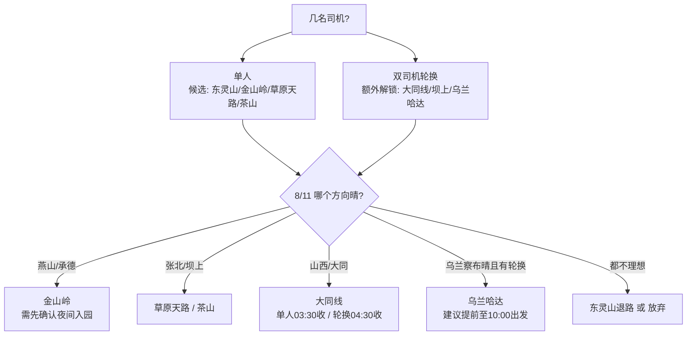

# 2026 英仙座流星雨：分线出行方案

更新时间：2026-08-04
拍摄窗口：2026-08-12 夜间至 2026-08-13 凌晨
出发地：北京城区（按天安门为路线基准）
器材：16mm f/1.8

本文以**行程维度**组织，回答的是「我有多少时间，该去哪、怎么安排」。
机位细节、住宿 POI、小红书线索见另外三份调研文档。

---

## 一、决定行程结构的两个硬约束

### 约束 1：产量集中在后半夜

辐射点（RA 03:12 / Dec +58.1）全夜爬升，观测流量正比于其高度角正弦值。
按 ZHR 100、无月光的理想暗空估算：

| 时段 | 辐射点高度 | 理论产量 |
|---|---:|---:|
| 21:00-22:00 | 15° | 27 颗/时 |
| 22:00-23:00 | 20° | 34 颗/时 |
| 23:00-00:00 | 26° | 44 颗/时 |
| 00:00-01:00 | 33° | 54 颗/时 |
| 01:00-02:00 | 40° | 64 颗/时 |
| 02:00-03:00 | 48° | 74 颗/时 |
| 03:00-04:00 | 56° | 82 颗/时 |

前半夜（21-00）占 28%，后半夜（00-04）占 72%，**后半夜产量是前半夜的 2.6 倍**。

由此得到收机时刻与产量的换算，这是所有行程取舍的标尺：

| 收机时刻 | 累计产量占比 |
|---|---:|
| 00:00 | 28% |
| 01:00 | 42% |
| 02:00 | 59% |
| 03:00 | 78% |
| 04:00 | 100% |

**推论：任何迫使你在 01:00 前离场的行程，最多只能拿到四成产量，而且砍掉的正是最精华的部分。**

### 约束 2：月光条件极好，成败只看云

2026-08-13 01:36 新月，8/12 月落 19:05，8/13 月升 05:39。整夜零月光干扰。
所以**唯一的变量是云量**，而云量在 8 天外的预报完全不可信——本项目 8/03 与 8/04 两版预报对上都湖的判断从「云量 19%、综合首选」翻转为「云量 97.8%、几乎全云」。

**因此：现在锁定的应该是行程档位，不是具体地点。** 地点留到 8/11 依云图在同档位内选。

---

## 二、行程档位总览

| 档位 | 时间预算 | 单人可达半径 | 轮换可达半径 | 产量 | 代表地点 |
|---|---|---|---|---:|---|
| 短线 S1 | 当天往返，6-8h | ≤ 2h | ≤ 2.5h | 42-60% | 东灵山、金山岭 |
| 短线 S2 | 一夜，含次日上午 | ≤ 2.6h | ≤ 4.6h | 100% | 金山岭、草原天路、大同线 |
| 长线 L1 | 两天一夜 | ≤ 5.5h | ≤ 6.5h | 100% | 乌兰哈达、大同土林、辉腾锡勒 |
| 长线 L2 | 三天两夜 | ≤ 6.5h | 不受限 | 100% | 上都湖联动、多伦湖 |

**当前时间窗口：请假 8/12 下午 + 8/13 上午，8/12 12:30 → 8/13 15:00，共 26.5 小时，对应 S2 档。**
具体地点未定，下文列出各选项供你依 8/11 云图与实际可调动的司机数自行选择。

### 驾驶模式对可达半径的影响

是否有第二名司机可轮换，是比地点选择更靠前的变量——它直接决定了哪些地点进入候选集。

轮换驾驶带来两个增益：副驾可在车上补眠；每人实际驾驶时长减半。但**车上补眠不等于床上睡眠**——坐姿、颠簸、光照与噪声使其恢复效率约为床上睡眠的一半。下文所有“等效休息”均按车上补眠 50% 折算。

---

# 三、短线方案

## S2 档：一夜往返（当前窗口对应档位）

窗口 8/12 12:30 出发、8/13 15:00 抵京，拍至 04:30。
返程已计入 8/13 周四下午进京拥堵 +20%、途中休息加油 +45min。

### 情形 A：单人驾驶

| 地点 | 单程 | 实际返程 | 需出发 | 床上睡眠 | 白天踩点 | 判定 |
|---|---:|---:|---|---:|---:|---|
| 东灵山 | 1.9h | 3.0h | 11:58 | 6.5h | 4.4h | ✓ 舒适 |
| 金山岭 | 2.6h | 3.9h | 11:07 | 5.6h | 3.6h | ✓ 舒适 |
| 草原天路 | 3.7h | 5.2h | 09:48 | 4.3h | 2.4h | ○ 可行 |
| 蔚县茶山 | 3.8h | 5.3h | 09:41 | 4.2h | 2.3h | ○ 可行 |
| 大同火山群 | 4.1h | 5.7h | 09:19 | 3.8h | 2.0h | △ 紧绷 |
| 大同土林 | 4.6h | 6.3h | 08:43 | 3.2h | 1.4h | △ 紧绷 |
| 乌兰哈达 | 5.1h | 6.9h | 08:07 | 2.6h | 0.9h | ✗ 超窗 |
| 上都湖 | 6.1h | 8.1h | 06:55 | 1.4h | 0h | ✗ 超窗 |

单人驾驶时，**内蒙线（乌兰哈达、上都湖）在此窗口出局**。它们要求 08:00 前上车，拍到 04:30 只能睡 2-3 小时再独自开 7 小时高速。即使提前到 02:30 收机，睡眠也仅 4.6h 而产量掉到 59%，两头不讨好。

### 情形 B：双司机轮换 + 车上补觉

车上补眠按 50% 恢复效率折算；每人单次连续驾驶上限按 2.5h 计：

| 地点 | 实际返程 | 换手次数 | 床上睡 | 车上补 | 等效休息 | 单次最长驾驶 | 判定 |
|---|---:|---:|---:|---:|---:|---:|---|
| 东灵山 | 3.0h | 2 | 6.5h | 1.5h | 7.2h | 1.0h | ✓ 充裕 |
| 金山岭 | 3.9h | 2 | 5.6h | 1.9h | 6.6h | 1.3h | ✓ 充裕 |
| 草原天路 | 5.2h | 3 | 4.3h | 2.6h | 5.6h | 1.3h | ✓ 可行 |
| 蔚县茶山 | 5.3h | 3 | 4.2h | 2.7h | 5.5h | 1.3h | ✓ 可行 |
| 大同火山群 | 5.7h | 3 | 3.8h | 2.8h | 5.2h | 1.4h | ✓ 可行 |
| 丰宁坝上 | 6.0h | 3 | 3.5h | 3.0h | 5.0h | 1.5h | ○ 勉强 |
| 大同土林 | 6.3h | 3 | 3.2h | 3.1h | 4.8h | 1.6h | ○ 勉强 |
| 乌兰哈达 | 6.9h | 3 | 2.6h | 3.4h | 4.3h | 1.7h | ○ 勉强 |
| 多伦湖 | 7.2h | 3 | 2.3h | 3.6h | 4.1h | 1.8h | ○ 勉强 |
| 辉腾锡勒 | 7.8h | 4 | 1.7h | 3.9h | 3.6h | 1.6h | △ 紧绷 |
| 上都湖 | 8.1h | 4 | 1.4h | 4.0h | 3.4h | 1.6h | △ 紧绷 |

**轮换驾驶把 S2 档的可达半径从约 2.6h 拉到约 4.6h。** 大同线从“紧绷”转为“可行”，乌兰哈达从“超窗”转为“勉强”。

但有两个需要注意的地方：

第一，**轮换提升的是安全余量，不是白天踩点时间**。乌兰哈达即使轮换，抵达后仍只有 0.9h 白天踩点，意味着几乎没时间选机位——而这是夜拍成片率的关键。想去这些点，更合理的做法是把出发时间提前，而不是靠轮换硬塞。

第二，**两人都拍到 04:30 时，两人都缺眠**。轮换的前提是至少有一人状态尚可；若两人全程同步熬夜，轮换的保护作用会打折扣。可考虑让一人在 02:00 后先回车睡，另一人看守相机拍完。

### 选项一：金山岭长城 · 139km / 2.6h

在「睡眠充足 + 产量拉满 + 前景强度」三者上唯一全占的点，且**单人驾驶即可轻松覆盖**。

- 单人睡 5.6h / 轮换等效 6.6h，是能拍满全窗口的点里最宽裕的
- 拍到 04:30，产量 100%
- 白天 3.6h 踩点，从容
- 前景：长城城墙、敌楼、山脊，强度为本次候选天花板
- 光污染 LP 3b，约 Bortle 4，21.51-21.25 mpsas

```
8/12  12:30  北京出发
      15:05  抵达，入住古北水镇/景区周边
      15:30-18:00  白天踩点，选定机位与构图
      18:00-19:30  晚饭、休整、装备检查
      20:30  到位
      21:00  完成对焦与构图（此后不再移动机位）
      21:30-04:30  连拍，核心时段 00:00-04:30
      05:00  回住处
8/13  11:00  起床、退房、简餐
      11:07  出发返京
      15:00  抵京
```

**关键前置动作：提前电话确认夜间入园。** 问清能否夜拍、闭园时间、有无摄影通道。若不能入园，长城前景优势消失。

### 选项二：草原天路 / 桦皮岭 · 235km / 3.7h

适用：8/11 云图显示张北方向更晴，或金山岭夜间不开放。单人可行（睡 4.3h），轮换更优（等效 5.6h）。

- 产量 100%
- 前景：公路 S 弯、风车、草坡、山脊，适合「流星 + 道路」构图
- 光污染 LP 2b，约 Bortle 3，比金山岭更暗
- 住张北县城或崇礼，补给住宿都稳

```
8/12  12:30 出发 → 16:11 抵张北入住 → 17:00-19:00 沿天路踩点
      21:30-04:30 连拍 → 05:00 睡
8/13  08:48 起床 → 09:48 出发 → 15:00 抵京
```

**注意：夜间车灯、弯道、牲畜风险都高，必须日落前定好机位，不要边开边找。**

### 选项三：蔚县茶山 · 221km / 3.8h

适用：想要更暗的天空，且能接受更硬核的路况。单人可行（睡 4.2h），轮换更优（等效 5.5h）。

- 产量 100%
- 光污染 LP 2b，约 Bortle 3，是北京周边硬核暗夜候选
- 前景：高海拔山地、村落、草坡、牛群，纵深强
- **风险：盘山夜路、弱信号；农家院少且条件朴素，必须提前订**

### 选项四：东灵山 / 百花山 · 107km / 1.9h

适用：只有一名司机且状态不佳、出发前遇严重拥堵、或想留足余量。

- 单人即可睡 6.5h，是全部选项里最宽裕的；产量 100%
- 距离最短，出问题时回旋余地最大
- 代价：受北京西部光污染影响，暗度最差，前景普通
- 适合作为兵败时的退路，而非追求画质的选择

### 选项五：大同线（火山群 4.1h / 土林 4.6h）

适用：8/11 云图显示只有山西方向晴。这条线在 8/04 那版预报里是唯一的 B 级窗口（火山群云 69.6%、土林云 34.8%）。

**这是轮换驾驶受益最大的选项**：单人时判定为“紧绷”（睡 3.2-3.8h），轮换后转为“可行”（等效 4.8-5.2h）。
单人前往需 03:30 提前收机（产量 78%）；轮换则可拍满到 04:30。住大同市区，补给最好。

### 选项六：乌兰哈达火山 · 422km / 5.1h（仅轮换可考虑）

适用：有双司机，且愿意用白天踩点时间换天气稳定性。

它是**唯一在两版预报里都排前二的点**（8/03 云 12%、8/04 云 35.7%），抗预报波动能力最强，且有官方暗夜保护区。

但在 26.5 小时窗口内代价明确：单人直接超窗；轮换也仅为“勉强”（等效休息 4.3h），且**抵达后只剩 0.9h 白天踩点**。
若确实想去，建议把出发时间从 12:30 提前至 10:00 前后，而不是靠轮换压缩休息。

### S2 档决策路径

先确定司机数（决定候选集范围），再依云图在集内选点：



---

## S1 档：当天往返（备查）

适用于完全无法请假的情形。当前窗口已覆盖 S2，此档仅作计划变更时的参考。

| 地点 | 单程 | 收机 | 抵京 | 连续清醒 | 产量 |
|---|---:|---|---|---:|---:|
| 东灵山 | 1.9h | 02:00 | 03:55 | 21h | 60% |
| 金山岭 | 2.6h | 01:00 | 03:40 | 21h | 42% |
| 草原天路 | 3.7h | 00:00 | 03:40 | 21h | 28% |

连续清醒 21 小时的认知损伤大致相当于血液酒精浓度 0.08%，已达酒驾标准；
而凌晨 2-6 点是昼夜节律最低谷，事故率约为白天的 5-6 倍，且返程多为山区夜路。

**轮换驾驶在 S1 档的价值比 S2 更大**。单人走 S1 基本不可接受；双司机时，副驾可在返程先睡，且每人只需应对一半夜路，可行性显著提升。

若走 S1，硬性前提（缺一不可）：白天补觉或请半天、**有换手司机或返程前车上睡 40 分钟**、次日不安排早间重要事项。做不到就放弃拍摄。

---

# 四、长线方案

以下方案需要比当前 26.5 小时更宽的窗口，作为**假期变更或后续年份**的储备。
共同前提：8/13 不限返京时间，或能多请一天。

长线档位下，**轮换驾驶从“提升可达半径”变为“降低疲劳强度”**——因为时间已不是瓶颈，单人也能睡足再上路。但 5h 以上车程仍建议双司机，尤其是含长距离高速的路段。

## L1 档：两天一夜（需 8/13 全天）

拍到 04:30、睡 6.5h、12:00 出发的返京时刻：

| 地点 | 单程 | 抵京时刻 | 天气可靠性 | 前景 |
|---|---:|---|---|---|
| 大同土林 | 4.6h | 18:16 | 8/04 云 34.8%（B 级） | 土柱、沟壑，电影感 |
| 乌兰哈达 | 5.1h | 18:52 | **两版预报都最优** | 火山锥、公路、荒野地平线 |
| 多伦湖 | 5.4h | 19:13 | 波动大 | 湖岸、湿地、观景平台 |
| 辉腾锡勒 | 5.9h | 19:49 | 8/04 云 43.4%（B 级） | 草原、风车、山梁 |

### L1 代表点：乌兰哈达火山 / G208 · 422km / 5.1h

**唯一在两版预报里都排前二的点**（8/03 云 12%、8/04 云 35.7%），抗预报波动能力最强。
加分项：官方暗夜保护区位于火山群西北约 10km、海拔约 1500m。

```
8/12  13:00 出发 → 18:00 抵白音察干镇入住吃饭
      日落前踩点：5/6 号火山外围、G208 北向、暗夜保护区方向
      21:30 定机位完成对焦 → 23:30-04:30 连拍
8/13  上午补觉 → 12:00 出发 → 约 18:50 抵京
```

**执行要点：不要在 5/6 号火山口核心区拍，游客头灯与车灯会毁片。沿 G208 往北找无灯路肩。**

## L2 档：三天两夜（需连休 8/12-8/14）

### L2 代表点：上都湖 + 元上都 + 多伦湖联动 · 436km / 6.1h

L2 的核心价值**不是更远，而是机动空间**。上都湖、元上都（0.9h）、多伦湖（1.4h）三点互为备份，可在 8/12 白天依实时云图选点，而非被锁死。这正好对冲了上都湖天气波动极大的问题。

```
8/11  下午出发 → 晚上抵正蓝旗，睡饱
8/12  白天看云图定点，三选一踩点 → 21:30-04:30 主拍
8/13  上午补拍元上都/多伦湖 → 下午分段返程
8/14  机动缓冲
```

**合规提醒：元上都遗址为世界文化遗产（2012 年列入），只在外围合法道路取景，不翻围栏、不夜间进入保护区、不用强光照射遗址本体。**

### L2 其他：远程冲刺（仅供了解）

| 地点 | 单程 | 说明 |
|---|---:|---|
| 库布齐七星湖 | 8.6h | 沙丘、孤树、07 沙漠公路；风沙伤镜头 |
| 乌拉盖九曲湾 | 12.1h | 8/03 版云量最低（6%），但阵风可达 45km/h |
| 腾格里月亮湖 | 14.2h | 暗夜顶级；北京自驾不合理，飞银川租车更现实 |

---

# 五、跨方案通用执行清单

## 拍摄参数（全画幅 16mm f/1.8）

| 用途 | 参数 | 备注 |
|---|---|---|
| 流星连拍 | f/1.8，8-13s，ISO 3200-6400 | 间隔 1s，RAW，连拍 3-5 小时 |
| 银河单张 | f/1.8，10-15s，ISO 1600-3200 | 星点优先，别迷信 500 法则 |
| 前景补光 | 低亮暖光 1-2s 扫过 | 不要照别人镜头 |

**务必关闭长曝光降噪**，否则每张后相机黑场等待会吃掉大量有效时间。

## 构图

- 地景控制在画面下 1/4 到 1/3，别让前景太高
- 想要**长轨迹**：朝南/东南/西南，避开辐射点 40-90 度
- 想要**放射感**：00:00 后朝北/东北，此时辐射点已升至 33° 以上
- 流星是随机事件，**固定机位连续拍远比频繁换构图重要**；21:00 前完成对焦构图

## 装备

三脚架、间隔快门/快门线、2-3 块电池或外接供电、红光头灯、**镜头防露带或暖宝宝**、保暖外套、露营椅、镜头布、热水与高热量食物。

8 月山地与草原凌晨体感远低于预报温度，湖边草地结露严重。

## 住宿必问三件事

最晚入住时间、**能否凌晨进出**、停车位置。夜拍收工是凌晨 5 点，很多民宿此时进不去。

## 出发前复核节点

- **8/9**：首次重刷云量，确认大方向
- **8/11**：复核并锁定住宿（此前不下不可退订单）
- **8/12 中午**：最终确认，可临场切换同档位备选

云量同时参考 Open-Meteo、Windy/ECMWF、晴天钟或天文通，**重点看高云和低云分层，不要只看「晴/多云」**。8/12 下午另查华北雷达回波，草原局地对流会突然发展。

## 安全底线

1. **04:30 是收机上限而非目标**——困了就提前撤，少拍 1 小时损失约 20% 产量，疲劳驾驶损失的可能是命
2. 返程时间必须倒推预留，不能「拍完再说」；8/13 周四下午进京方向会堵
3. **轮换驾驶的纪律**：每人单次连续驾驶不超 2.5h；换手必须靠服务区或安全地点，不在应急车道；副驾睡觉时安全带不可解；两人都困时先停车睡 20-30 分钟再上路，不要接力硬撑
4. 不进私人草场、不翻围栏、不把车开进未知草地或沙地
5. 夜间注意牲畜与无灯车辆；山区盘山路减速
6. 拍摄礼仪：红光头灯、低声交流、不用远光扫机位、不在他人镜头前补光

---

# 六、小结

26.5 小时窗口下，**司机数量比地点选择更先决**——它直接决定了候选集的范围：

单人驾驶时可达半径约 2.6h，候选为东灵山、金山岭（充裕）与草原天路、蔚县茶山（可行），内蒙线出局。

双司机轮换时可达半径拉到约 4.6h，额外解锁大同线（受益最大，从紧绷转为可行）与丰宁坝上；乌兰哈达从超窗转为勉强，但白天踩点时间仍不足，想去建议提前出发而非压缩休息。

上述选项覆盖燕山、坝上、山西、乌兰察布四个相对独立的天气系统，不会被单一方向的云全灭。

建议的决策顺序：先确定能否轮换（定候选集）→ 8/11 看云图（定方向）→ 8/12 中午最终确认（定点）。

---

## 数据说明

- 车程与距离：高德 Web Service 驾车路径规划静态结果，出发当天以高德 App 实时路况为准
- 云量与气温：Open-Meteo 逐小时预报，查询时间 2026-08-03 与 2026-08-04；两版差异显著，需临近重刷
- 光污染：David Lorenz 2025 Light Pollution Atlas，为天顶人工亮度模型采样，文中「约 Bortle」仅供摄影直觉参考，不等同现场目视等级
- 辐射点高度与产量：按 IMO 2026 英仙座参数（峰值 8/12-13，ZHR 100，RA 03:12 / Dec +58.1）本地计算，为理想暗空理论值，实际受云量、光污染、视场遮挡影响会显著低于此数
- 月相：Timeanddate 北京 2026 年 8 月数据，2026-08-13 01:36 新月
