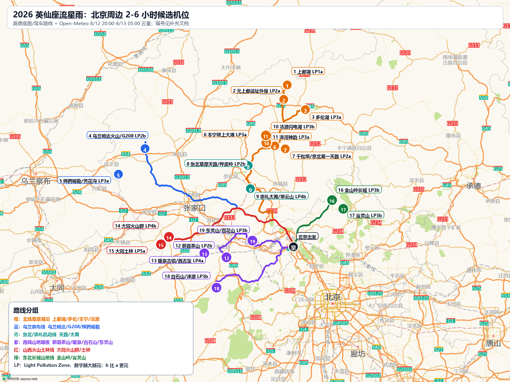
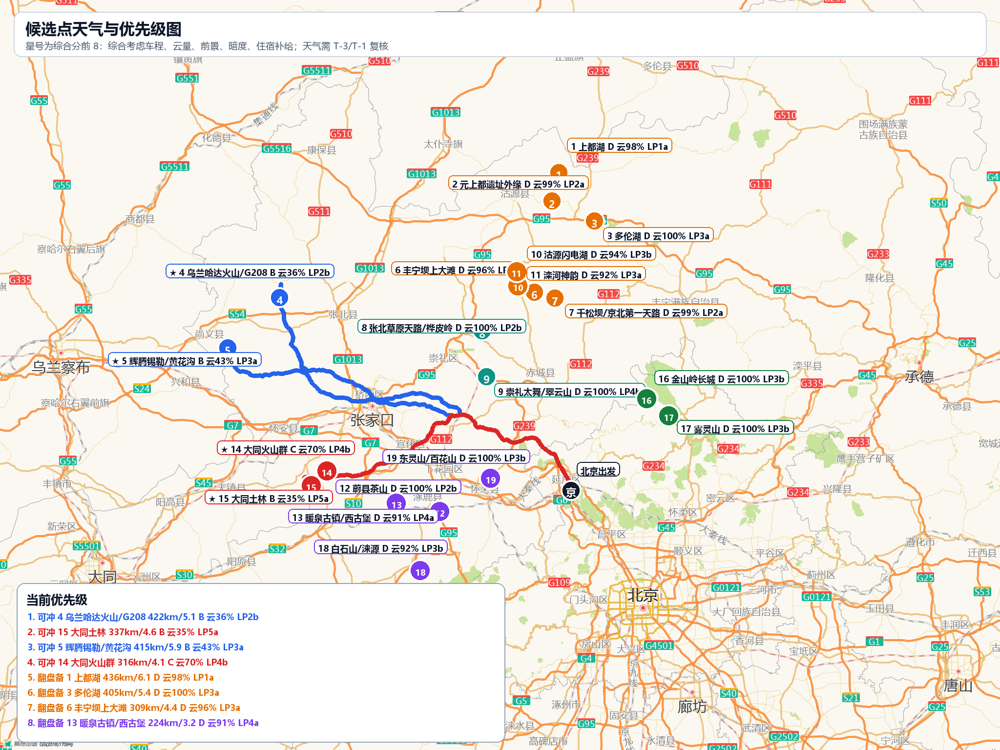

# 2026 英仙座流星雨：北京周边 2-6 小时机位扩展

更新时间：2026-08-04  
拍摄窗口：2026-08-12 夜间至 2026-08-13 凌晨，北京时间 20:00-05:00  
硬数据来源：高德 Web Service 驾车路线/静态地图、Open-Meteo 逐小时预报、David Lorenz 2025 Light Pollution Atlas 亚洲 1/120° 栅格采样。小红书部分用于参考实拍经验和机位热度，不作为通行/开放证明。

## 先给结论

这次不只看内蒙，按“天气窗口 + 5-6 小时车程 + 前景质量 + 暗度 + 住宿补给 + 小红书实拍信号”重新排了一遍。按 2026-08-04 这版逐小时云量，当前最值得优先准备的是：

- 4 乌兰哈达火山/G208：422km/5.1h，B 云36%，LP2b，乌兰察布火山线。
- 15 大同土林：337km/4.6h，B 云35%，LP5a，山西火山土林线。
- 5 辉腾锡勒/黄花沟：415km/5.9h，B 云43%，LP3a，乌兰察布火山线。
- 14 大同火山群：316km/4.1h，C 云70%，LP4b，山西火山土林线。

重要变化：这一版预报对北线湖泊/坝上/沽源/张北/东线非常不友好，很多点在 8/12 夜间显示 D 级高云量。它们仍然值得保留为机位池，但不能按现在的天气当主方案押注。真正需要在 8 月 9 日、8 月 11 日、8 月 12 日中午连续复刷云量后再定。

我会把方案分成三类：

- 当前天气可冲：乌兰哈达/G208、大同土林、辉腾锡勒/黄花沟；大同火山群作为同线补充，但云量边缘。
- 天气转晴优先切换：上都湖/多伦湖、丰宁坝上/千松坝、沽源闪电湖/滦河神韵、蔚县茶山。
- 前景强但需许可或管理确认：金山岭、雾灵山、白石山、元上都遗址外缘、大同土林。

## 更新后的线路图

## 总表

> **2026-08-09 补充说明（光污染标注的适用范围）**
>
> 下表每个地点的光污染等级由**单一坐标**采样得出，对范围较大的地点不能代表全域。
>
> 实测例证：第 15 行「张北草原天路/桦皮岭」标为 LP 2b（Bortle 3），但该路东西向全长约 60km，沿线实际跨越 **2b 到 5b 共三级**——中段（41.15, 114.70）因旅游开发密集实为 LP 5b（Bortle 6），比东灵山还亮；而西口以西（40.98, 114.42）为 2b、东口桦皮岭（41.05, 115.00）为 3a。
>
> **使用时须精确到具体坐标，不可按地名笼统判断。** 沿线逐点采样见《京藏-乌兰哈达线沿途机位手册.md》。
>
> 另：本表「8/12 夜天气」列为 8/04 前后数据，**已全部过期**，最新见《英仙座流星雨天气快照-0809.md》。

| 排名 | 编号 | 地点 | 车程 | 8/12 夜天气 | 光污染等级 | 光污染/暗度 | 前景 | 综合建议 |
|---:|---:|---|---:|---|---|---|---|---|
| 1 | 4 | 乌兰哈达火山/G208 | 422km / 5.1h | B，均云35.7%，云21-60%，降水概率峰值27%，16.5-18.9℃，阵风31.3km/h | LP 2b，LPI 0.19-0.33，约 Bortle 3，21.81-21.69 mpsas | 很暗，但热门火山口、营地和车灯会显著污染局部画面。 | 火山锥、火山口剪影、公路、荒野地平线，前景辨识度极高。 | 主推/优先踩点 |
| 2 | 15 | 大同土林 | 337km / 4.6h | B，均云34.8%，云8-68%，降水概率峰值27%，18.9-23.6℃，阵风34.6km/h | LP 5a，LPI 3.00-5.20，约 Bortle 5-6，20.49-20.02 mpsas | 中等偏暗，但离大同城区较近。 | 土柱、沟壑、低角度前景，画面很有电影感。 | 主推/优先踩点 |
| 3 | 5 | 辉腾锡勒/黄花沟 | 415km / 5.9h | B，均云43.4%，云5-100%，降水概率峰值22%，13.7-15.7℃，阵风24.5km/h | LP 3a，LPI 0.33-0.58，约 Bortle 3-4，21.69-21.51 mpsas | 较暗，但景区/住宿灯较多。 | 草原、风车、山梁，适合风电剪影和草坡。 | 主推/优先踩点 |
| 4 | 14 | 大同火山群 | 316km / 4.1h | C，均云69.6%，云20-100%，降水概率峰值25%，18.0-21.2℃，阵风30.2km/h | LP 4b，LPI 1.73-3.00，约 Bortle 5，20.91-20.49 mpsas | 中等偏暗，东南侧大同市和云州灯光需避开构图方向。 | 火山锥、荒坡、停车点、火山口剪影，前景强且不俗套。 | 临近天气转好可冲 |
| 5 | 1 | 上都湖 | 436km / 6.1h | D，均云97.8%，云93-100%，降水概率峰值27%，15.4-16.8℃，阵风32.8km/h | LP 1a，LPI 0.01-0.06，约 Bortle 1-2，21.99-21.93 mpsas | 很暗，远离正蓝旗镇和湖边营地灯后表现好。 | 湖岸、蒙古包、孤树、草坡，16mm 可做湖面+北天广角。 | 仅天气翻盘备选 |
| 6 | 3 | 多伦湖 | 405km / 5.4h | D，均云100.0%，云100-100%，降水概率峰值27%，16.9-17.4℃，阵风34.9km/h | LP 3a，LPI 0.33-0.58，约 Bortle 3-4，21.69-21.51 mpsas | 很暗，县城灯在局部方向有影响。 | 湖岸、湿地、草坡、观景平台，适合拍湖岸流星和银河。 | 仅天气翻盘备选 |
| 7 | 6 | 丰宁坝上大滩 | 309km / 4.4h | D，均云95.8%，云87-100%，降水概率峰值29%，14.8-16.8℃，阵风33.5km/h | LP 3a，LPI 0.33-0.58，约 Bortle 3-4，21.69-21.51 mpsas | 偏暗，离大滩镇和住宿灯远一点即可明显改善。 | 草原、马场、木栅栏、蒙古包、孤树，宽广易构图。 | 仅天气翻盘备选 |
| 8 | 13 | 暖泉古镇/西古堡 | 224km / 3.2h | D，均云91.0%，云71-100%，降水概率峰值33%，19.2-22.1℃，阵风31.3km/h | LP 4a，LPI 1.00-1.73，约 Bortle 4-5，21.25-20.91 mpsas | 中等，古镇灯和县城灯会影响，适合做前景而非极暗。 | 古堡、城墙、巷口、老建筑，文化前景非常强。 | 仅天气翻盘备选 |
| 9 | 2 | 元上都遗址外缘 | 403km / 5.5h | D，均云99.4%，云99-100%，降水概率峰值29%，15.7-17.8℃，阵风31.3km/h | LP 2a，LPI 0.11-0.19，约 Bortle 2-3，21.89-21.81 mpsas | 很暗，但应避开游客中心和镇区方向。 | 遗址轮廓、草原地平线，文化前景强。 | 仅天气翻盘备选 |
| 10 | 10 | 沽源闪电湖 | 298km / 4.3h | D，均云93.7%，云80-100%，降水概率峰值25%，14.9-16.9℃，阵风38.2km/h | LP 3b，LPI 0.58-1.00，约 Bortle 4，21.51-21.25 mpsas | 偏暗，湖边营地灯和车灯需规避。 | 湖面、湿地、草原、木栈道，流星雨画面会比较柔和。 | 仅天气翻盘备选 |
| 11 | 11 | 滦河神韵 | 307km / 4.5h | D，均云92.0%，云74-100%，降水概率峰值25%，15.0-17.2℃，阵风38.9km/h | LP 3a，LPI 0.33-0.58，约 Bortle 3-4，21.69-21.51 mpsas | 偏暗，附近村镇灯光较少。 | 湿地河湾、草原曲线，适合做地景轮廓。 | 仅天气翻盘备选 |
| 12 | 18 | 白石山/涞源 | 224km / 3.1h | D，均云92.4%，云80-100%，降水概率峰值41%，13.6-15.2℃，阵风26.3km/h | LP 3b，LPI 0.58-1.00，约 Bortle 4，21.51-21.25 mpsas | 偏暗，涞源县城方向需避开。 | 山体、古长城、村落轮廓，西南线前景不错。 | 仅天气翻盘备选 |
| 13 | 16 | 金山岭长城 | 139km / 2.6h | D，均云100.0%，云100-100%，降水概率峰值29%，21.2-22.5℃，阵风27.0km/h | LP 3b，LPI 0.58-1.00，约 Bortle 4，21.51-21.25 mpsas | 中等，京津冀光害和景区灯光存在。 | 长城城墙、敌楼、山脊，前景极强。 | 仅天气翻盘备选 |
| 14 | 7 | 千松坝/京北第一天路 | 255km / 4.9h | D，均云98.9%，云97-100%，降水概率峰值25%，14.6-15.0℃，阵风31.0km/h | LP 2a，LPI 0.11-0.19，约 Bortle 2-3，21.89-21.81 mpsas | 偏暗，但景区入口和住宿灯会影响。 | 山脊、松林、草坡、观景台，前景层次比大滩更好。 | 仅天气翻盘备选 |
| 15 | 8 | 张北草原天路/桦皮岭 | 235km / 3.7h | D，均云100.0%，云100-100%，降水概率峰值27%，14.6-15.3℃，阵风32.4km/h | LP 2b，LPI 0.19-0.33，约 Bortle 3，21.81-21.69 mpsas | 中等偏暗，风车/民宿/车灯会污染局部。 | 公路 S 弯、风车、草坡、山脊，适合流星+道路前景。 | 仅天气翻盘备选 |
| 16 | 12 | 蔚县茶山 | 221km / 3.8h | D，均云100.0%，云100-100%，降水概率峰值49%，14.1-15.3℃，阵风32.0km/h | LP 2b，LPI 0.19-0.33，约 Bortle 3，21.81-21.69 mpsas | 很暗，是北京周边硬核暗夜候选。 | 高海拔山地、村落、草坡、牛群，暗夜和纵深都很强。 | 仅天气翻盘备选 |
| 17 | 9 | 崇礼太舞/翠云山 | 194km / 4.1h | D，均云100.0%，云100-100%，降水概率峰值33%，14.2-14.8℃，阵风23.8km/h | LP 4b，LPI 1.73-3.00，约 Bortle 5，20.91-20.49 mpsas | 中等，度假区灯光明显，需离小镇核心远一点。 | 山地、滑雪小镇、山脊、缆车/建筑剪影，前景现代感强。 | 仅天气翻盘备选 |
| 18 | 17 | 雾灵山 | 148km / 2.4h | D，均云100.0%，云100-100%，降水概率峰值41%，17.3-17.9℃，阵风70.6km/h | LP 3b，LPI 0.58-1.00，约 Bortle 4，21.51-21.25 mpsas | 中等偏暗，东侧湿度和云雾概率偏高。 | 山顶、云海、森林线、日出，适合星空+云海组合。 | 仅天气翻盘备选 |
| 19 | 19 | 东灵山/百花山 | 107km / 1.9h | D，均云100.0%，云100-100%，降水概率峰值37%，16.4-16.8℃，阵风38.5km/h | LP 3b，LPI 0.58-1.00，约 Bortle 4，21.51-21.25 mpsas | 中等，受北京西部光污染影响，暗度不如茶山/坝上。 | 近郊高山、山脊、草甸，适合做近程保底。 | 仅天气翻盘备选 |

## 地点详解

### 1. 上都湖

- 车程：北京出发约 436 km / 6.1 h（高德驾车规划静态结果；实际以 8 月 12 日出发当天实时路况为准）。
- 天气窗口：D 级，平均云量 97.8%，逐小时范围 93-100%，降水概率峰值 27%，温度 15.4-16.8℃，阵风峰值 32.8 km/h。
- 小红书笔记信号：小红书可见“上都湖银河”“星空与一棵树”“上都湖星空住宿”等笔记，实拍信号强。 关键词入口：[上都湖 搜索](https://www.xiaohongshu.com/search_result?keyword=%E4%B8%8A%E9%83%BD%E6%B9%96%20%E6%98%9F%E7%A9%BA%20%E9%93%B6%E6%B2%B3&source=web_explore_feed&type=51)。
- 光污染等级：LP 1a，LPI 0.01-0.06，约 Bortle 1-2，21.99-21.93 mpsas。LP Zone 是天顶人工亮度模型采样，不等同于现场肉眼 Bortle；同一地点还会受地平线光穹、车灯、营地灯影响。
- 周边环境/前景：湖岸、蒙古包、孤树、草坡，16mm 可做湖面+北天广角。
- 光污染判断：很暗，远离正蓝旗镇和湖边营地灯后表现好。
- 住宿：优先住正蓝旗/上都镇或湖边合规营地；湖边住宿旺季要提前确认热水、停车和夜间灯光。
- 饮食补给：正蓝旗补给更稳；湖边多为民宿/牧家乐，夜里基本没有热食。
- 机位注意：湖边草场和湿地不要硬闯；先白天踩点，确认是否属于私人草场或景区管理区。

### 2. 元上都遗址外缘

- 车程：北京出发约 403 km / 5.5 h（高德驾车规划静态结果；实际以 8 月 12 日出发当天实时路况为准）。
- 天气窗口：D 级，平均云量 99.4%，逐小时范围 99-100%，降水概率峰值 29%，温度 15.7-17.8℃，阵风峰值 31.3 km/h。
- 小红书笔记信号：和上都湖笔记经常联动出现，更多适合作为上都湖周边机动点。 关键词入口：[元上都遗址外缘 搜索](https://www.xiaohongshu.com/search_result?keyword=%E5%85%83%E4%B8%8A%E9%83%BD%20%E6%98%9F%E7%A9%BA%20%E9%93%B6%E6%B2%B3&source=web_explore_feed&type=51)。
- 光污染等级：LP 2a，LPI 0.11-0.19，约 Bortle 2-3，21.89-21.81 mpsas。LP Zone 是天顶人工亮度模型采样，不等同于现场肉眼 Bortle；同一地点还会受地平线光穹、车灯、营地灯影响。
- 周边环境/前景：遗址轮廓、草原地平线，文化前景强。
- 光污染判断：很暗，但应避开游客中心和镇区方向。
- 住宿：住正蓝旗最方便；不要把住宿押在遗址周边。
- 饮食补给：正蓝旗县城餐饮选择明显好于湖边。
- 机位注意：严格只取外围合法道路/停车区，夜间不要进入遗址保护区。

### 3. 多伦湖

- 车程：北京出发约 405 km / 5.4 h（高德驾车规划静态结果；实际以 8 月 12 日出发当天实时路况为准）。
- 天气窗口：D 级，平均云量 100.0%，逐小时范围 100-100%，降水概率峰值 27%，温度 16.9-17.4℃，阵风峰值 34.9 km/h。
- 小红书笔记信号：小红书可见“多伦越野捡玛瑙拍银河”“多伦湖观星/日落”等信号。 关键词入口：[多伦湖 搜索](https://www.xiaohongshu.com/search_result?keyword=%E5%A4%9A%E4%BC%A6%E6%B9%96%20%E6%98%9F%E7%A9%BA%20%E9%93%B6%E6%B2%B3&source=web_explore_feed&type=51)。
- 光污染等级：LP 3a，LPI 0.33-0.58，约 Bortle 3-4，21.69-21.51 mpsas。LP Zone 是天顶人工亮度模型采样，不等同于现场肉眼 Bortle；同一地点还会受地平线光穹、车灯、营地灯影响。
- 周边环境/前景：湖岸、湿地、草坡、观景平台，适合拍湖岸流星和银河。
- 光污染判断：很暗，县城灯在局部方向有影响。
- 住宿：多伦县住宿和补给比湖边更稳；湖边住宿需提前问夜间进出。
- 饮食补给：县城餐饮选择较多，湖边夜间补给弱。
- 机位注意：湖区夜间风大、湿气重，注意镜头结露；部分景区道路夜间可能受限。

### 4. 乌兰哈达火山/G208

- 车程：北京出发约 422 km / 5.1 h（高德驾车规划静态结果；实际以 8 月 12 日出发当天实时路况为准）。
- 天气窗口：B 级，平均云量 35.7%，逐小时范围 21-60%，降水概率峰值 27%，温度 16.5-18.9℃，阵风峰值 31.3 km/h。
- 小红书笔记信号：小红书可见“乌兰察布G208银河”“火山口银河”“新手观星拍摄”等大量近期笔记。 关键词入口：[乌兰哈达火山/G208 搜索](https://www.xiaohongshu.com/search_result?keyword=%E4%B9%8C%E5%85%B0%E5%93%88%E8%BE%BE%E7%81%AB%E5%B1%B1%20%E6%98%9F%E7%A9%BA%20%E9%93%B6%E6%B2%B3&source=web_explore_feed&type=51)。
- 光污染等级：LP 2b，LPI 0.19-0.33，约 Bortle 3，21.81-21.69 mpsas。LP Zone 是天顶人工亮度模型采样，不等同于现场肉眼 Bortle；同一地点还会受地平线光穹、车灯、营地灯影响。
- 周边环境/前景：火山锥、火山口剪影、公路、荒野地平线，前景辨识度极高。
- 光污染判断：很暗，但热门火山口、营地和车灯会显著污染局部画面。
- 住宿：住察右后旗白音察干镇最稳；也可住火山营地但要问灯光和夜间车流。
- 饮食补给：白音察干镇吃饭补给方便；火山核心区夜间补给弱。
- 机位注意：不要在火山口边缘夜间乱走；避开 5/6 号火山核心区车灯，优先外缘和 G208 北向。

### 5. 辉腾锡勒/黄花沟

- 车程：北京出发约 415 km / 5.9 h（高德驾车规划静态结果；实际以 8 月 12 日出发当天实时路况为准）。
- 天气窗口：B 级，平均云量 43.4%，逐小时范围 5-100%，降水概率峰值 22%，温度 13.7-15.7℃，阵风峰值 24.5 km/h。
- 小红书笔记信号：小红书上草原星空信号存在，但这次更适合作为乌兰哈达西侧天气转好备选。 关键词入口：[辉腾锡勒/黄花沟 搜索](https://www.xiaohongshu.com/search_result?keyword=%E8%BE%89%E8%85%BE%E9%94%A1%E5%8B%92%20%E6%98%9F%E7%A9%BA%20%E9%93%B6%E6%B2%B3&source=web_explore_feed&type=51)。
- 光污染等级：LP 3a，LPI 0.33-0.58，约 Bortle 3-4，21.69-21.51 mpsas。LP Zone 是天顶人工亮度模型采样，不等同于现场肉眼 Bortle；同一地点还会受地平线光穹、车灯、营地灯影响。
- 周边环境/前景：草原、风车、山梁，适合风电剪影和草坡。
- 光污染判断：较暗，但景区/住宿灯较多。
- 住宿：黄花沟/辉腾锡勒周边住宿多，但夜间灯光不可控；也可住察右中旗。
- 饮食补给：景区和镇上旺季餐饮够用，夜间补给弱。
- 机位注意：8 月草原夜风大，景区夜间通行和停车点要提前电话确认。

### 6. 丰宁坝上大滩

- 车程：北京出发约 309 km / 4.4 h（高德驾车规划静态结果；实际以 8 月 12 日出发当天实时路况为准）。
- 天气窗口：D 级，平均云量 95.8%，逐小时范围 87-100%，降水概率峰值 29%，温度 14.8-16.8℃，阵风峰值 33.5 km/h。
- 小红书笔记信号：小红书可见“丰宁坝上银河实拍”“北京周边看银河”“拍银河看这一篇”等笔记。 关键词入口：[丰宁坝上大滩 搜索](https://www.xiaohongshu.com/search_result?keyword=%E4%B8%B0%E5%AE%81%E5%9D%9D%E4%B8%8A%20%E6%98%9F%E7%A9%BA%20%E9%93%B6%E6%B2%B3&source=web_explore_feed&type=51)。
- 光污染等级：LP 3a，LPI 0.33-0.58，约 Bortle 3-4，21.69-21.51 mpsas。LP Zone 是天顶人工亮度模型采样，不等同于现场肉眼 Bortle；同一地点还会受地平线光穹、车灯、营地灯影响。
- 周边环境/前景：草原、马场、木栅栏、蒙古包、孤树，宽广易构图。
- 光污染判断：偏暗，离大滩镇和住宿灯远一点即可明显改善。
- 住宿：大滩镇住宿密集，民宿/度假村多，适合第一次租车夜拍。
- 饮食补给：大滩镇餐饮和超市方便，夜拍前吃饭补给最省心。
- 机位注意：很多草场是私人区域，不要压草地；旺季车灯多，机位要离镇区和营地远。

### 7. 千松坝/京北第一天路

- 车程：北京出发约 255 km / 4.9 h（高德驾车规划静态结果；实际以 8 月 12 日出发当天实时路况为准）。
- 天气窗口：D 级，平均云量 98.9%，逐小时范围 97-100%，降水概率峰值 25%，温度 14.6-15.0℃，阵风峰值 31.0 km/h。
- 小红书笔记信号：小红书有“丰宁坝上看星星绝佳地点”“英仙座流星雨”等相关笔记，常和大滩联动。 关键词入口：[千松坝/京北第一天路 搜索](https://www.xiaohongshu.com/search_result?keyword=%E5%8D%83%E6%9D%BE%E5%9D%9D%20%E6%98%9F%E7%A9%BA%20%E9%93%B6%E6%B2%B3&source=web_explore_feed&type=51)。
- 光污染等级：LP 2a，LPI 0.11-0.19，约 Bortle 2-3，21.89-21.81 mpsas。LP Zone 是天顶人工亮度模型采样，不等同于现场肉眼 Bortle；同一地点还会受地平线光穹、车灯、营地灯影响。
- 周边环境/前景：山脊、松林、草坡、观景台，前景层次比大滩更好。
- 光污染判断：偏暗，但景区入口和住宿灯会影响。
- 住宿：住大滩镇最稳；不要指望深夜在景区内找住宿或补给。
- 饮食补给：大滩镇解决晚饭和水，进山前备足热饮。
- 机位注意：景区道路夜间是否开放不确定，必须白天踩点并确认可停车/可进入。

### 8. 张北草原天路/桦皮岭

- 车程：北京出发约 235 km / 3.7 h（高德驾车规划静态结果；实际以 8 月 12 日出发当天实时路况为准）。
- 天气窗口：D 级，平均云量 100.0%，逐小时范围 100-100%，降水概率峰值 27%，温度 14.6-15.3℃，阵风峰值 32.4 km/h。
- 小红书笔记信号：小红书可见“张北草原天路的星空”“草原天路拍星空攻略”“北京3h怒拍银河”等近期笔记。 关键词入口：[张北草原天路/桦皮岭 搜索](https://www.xiaohongshu.com/search_result?keyword=%E5%BC%A0%E5%8C%97%E8%8D%89%E5%8E%9F%E5%A4%A9%E8%B7%AF%20%E6%98%9F%E7%A9%BA%20%E9%93%B6%E6%B2%B3&source=web_explore_feed&type=51)。
- 光污染等级：LP 2b，LPI 0.19-0.33，约 Bortle 3，21.81-21.69 mpsas。LP Zone 是天顶人工亮度模型采样，不等同于现场肉眼 Bortle；同一地点还会受地平线光穹、车灯、营地灯影响。
- 周边环境/前景：公路 S 弯、风车、草坡、山脊，适合流星+道路前景。
- 光污染判断：中等偏暗，风车/民宿/车灯会污染局部。
- 住宿：可住张北县城、崇礼或天路沿线民宿；夜间进出要问停车和路况。
- 饮食补给：县城/崇礼吃饭稳，天路沿线夜间补给弱。
- 机位注意：草原天路夜间车灯、弯道和牲畜风险都高，不建议边开边找点；日落前定机位。

### 9. 崇礼太舞/翠云山

- 车程：北京出发约 194 km / 4.1 h（高德驾车规划静态结果；实际以 8 月 12 日出发当天实时路况为准）。
- 天气窗口：D 级，平均云量 100.0%，逐小时范围 100-100%，降水概率峰值 33%，温度 14.2-14.8℃，阵风峰值 23.8 km/h。
- 小红书笔记信号：小红书可见“崇礼观星最佳地点”“太舞小镇看星空”“崇礼能看到银河吗”等搜索信号。 关键词入口：[崇礼太舞/翠云山 搜索](https://www.xiaohongshu.com/search_result?keyword=%E5%B4%87%E7%A4%BC%20%E5%A4%AA%E8%88%9E%20%E6%98%9F%E7%A9%BA%20%E9%93%B6%E6%B2%B3&source=web_explore_feed&type=51)。
- 光污染等级：LP 4b，LPI 1.73-3.00，约 Bortle 5，20.91-20.49 mpsas。LP Zone 是天顶人工亮度模型采样，不等同于现场肉眼 Bortle；同一地点还会受地平线光穹、车灯、营地灯影响。
- 周边环境/前景：山地、滑雪小镇、山脊、缆车/建筑剪影，前景现代感强。
- 光污染判断：中等，度假区灯光明显，需离小镇核心远一点。
- 住宿：住宿最稳，太舞/崇礼酒店多，适合天气不确定时机动。
- 饮食补给：餐饮丰富，夜间回酒店恢复体力容易。
- 机位注意：暗度不如坝上/茶山/上都湖；更像舒适备选，而不是追求极限暗夜。

### 10. 沽源闪电湖

- 车程：北京出发约 298 km / 4.3 h（高德驾车规划静态结果；实际以 8 月 12 日出发当天实时路况为准）。
- 天气窗口：D 级，平均云量 93.7%，逐小时范围 80-100%，降水概率峰值 25%，温度 14.9-16.9℃，阵风峰值 38.2 km/h。
- 小红书笔记信号：小红书可见“沽源县拍星空的地方”“闪电湖露营/拍星空”等搜索信号。 关键词入口：[沽源闪电湖 搜索](https://www.xiaohongshu.com/search_result?keyword=%E6%B2%BD%E6%BA%90%E9%97%AA%E7%94%B5%E6%B9%96%20%E6%98%9F%E7%A9%BA%20%E9%93%B6%E6%B2%B3&source=web_explore_feed&type=51)。
- 光污染等级：LP 3b，LPI 0.58-1.00，约 Bortle 4，21.51-21.25 mpsas。LP Zone 是天顶人工亮度模型采样，不等同于现场肉眼 Bortle；同一地点还会受地平线光穹、车灯、营地灯影响。
- 周边环境/前景：湖面、湿地、草原、木栈道，流星雨画面会比较柔和。
- 光污染判断：偏暗，湖边营地灯和车灯需规避。
- 住宿：住沽源县城或湖边合规营地；湖边住宿提前确认夜间进出。
- 饮食补给：县城吃饭方便，湖边适合提前带水和干粮。
- 机位注意：湿气、蚊虫、镜头结露是核心问题；湖边风大，三脚架要压稳。

### 11. 滦河神韵

- 车程：北京出发约 307 km / 4.5 h（高德驾车规划静态结果；实际以 8 月 12 日出发当天实时路况为准）。
- 天气窗口：D 级，平均云量 92.0%，逐小时范围 74-100%，降水概率峰值 25%，温度 15.0-17.2℃，阵风峰值 38.9 km/h。
- 小红书笔记信号：小红书相关词更多和闪电湖、沽源观星联动，单点星空笔记少于闪电湖。 关键词入口：[滦河神韵 搜索](https://www.xiaohongshu.com/search_result?keyword=%E6%BB%A6%E6%B2%B3%E7%A5%9E%E9%9F%B5%20%E6%98%9F%E7%A9%BA%20%E9%93%B6%E6%B2%B3&source=web_explore_feed&type=51)。
- 光污染等级：LP 3a，LPI 0.33-0.58，约 Bortle 3-4，21.69-21.51 mpsas。LP Zone 是天顶人工亮度模型采样，不等同于现场肉眼 Bortle；同一地点还会受地平线光穹、车灯、营地灯影响。
- 周边环境/前景：湿地河湾、草原曲线，适合做地景轮廓。
- 光污染判断：偏暗，附近村镇灯光较少。
- 住宿：住沽源县城更稳；景区夜间管理要提前确认。
- 饮食补给：餐饮依赖沽源县城。
- 机位注意：夜间入园/停车不确定，建议作为闪电湖一带的白天踩点和备用前景。

### 12. 蔚县茶山

- 车程：北京出发约 221 km / 3.8 h（高德驾车规划静态结果；实际以 8 月 12 日出发当天实时路况为准）。
- 天气窗口：D 级，平均云量 100.0%，逐小时范围 100-100%，降水概率峰值 49%，温度 14.1-15.3℃，阵风峰值 32.0 km/h。
- 小红书笔记信号：小红书可见“茶山追英仙座流星雨”“北京4小时可达茶山”“蔚县茶山银河更绝”等近期笔记。 关键词入口：[蔚县茶山 搜索](https://www.xiaohongshu.com/search_result?keyword=%E8%94%9A%E5%8E%BF%E8%8C%B6%E5%B1%B1%20%E6%98%9F%E7%A9%BA%20%E9%93%B6%E6%B2%B3&source=web_explore_feed&type=51)。
- 光污染等级：LP 2b，LPI 0.19-0.33，约 Bortle 3，21.81-21.69 mpsas。LP Zone 是天顶人工亮度模型采样，不等同于现场肉眼 Bortle；同一地点还会受地平线光穹、车灯、营地灯影响。
- 周边环境/前景：高海拔山地、村落、草坡、牛群，暗夜和纵深都很强。
- 光污染判断：很暗，是北京周边硬核暗夜候选。
- 住宿：茶山村农家院少且条件朴素，务必提前订；也可住蔚县县城但夜里往返很累。
- 饮食补给：村里补给弱，蔚县县城提前吃饭并带足水和保暖。
- 机位注意：盘山路、夜路、无信号/弱信号是最大风险；不建议深夜继续找新点。

### 13. 暖泉古镇/西古堡

- 车程：北京出发约 224 km / 3.2 h（高德驾车规划静态结果；实际以 8 月 12 日出发当天实时路况为准）。
- 天气窗口：D 级，平均云量 91.0%，逐小时范围 71-100%，降水概率峰值 33%，温度 19.2-22.1℃，阵风峰值 31.3 km/h。
- 小红书笔记信号：小红书更多是古镇/打树花旅行笔记，星空信号弱于茶山。 关键词入口：[暖泉古镇/西古堡 搜索](https://www.xiaohongshu.com/search_result?keyword=%E6%9A%96%E6%B3%89%E5%8F%A4%E9%95%87%20%E6%98%9F%E7%A9%BA%20%E9%93%B6%E6%B2%B3&source=web_explore_feed&type=51)。
- 光污染等级：LP 4a，LPI 1.00-1.73，约 Bortle 4-5，21.25-20.91 mpsas。LP Zone 是天顶人工亮度模型采样，不等同于现场肉眼 Bortle；同一地点还会受地平线光穹、车灯、营地灯影响。
- 周边环境/前景：古堡、城墙、巷口、老建筑，文化前景非常强。
- 光污染判断：中等，古镇灯和县城灯会影响，适合做前景而非极暗。
- 住宿：暖泉和蔚县县城住宿都方便，适合和茶山做一远一近组合。
- 饮食补给：古镇餐饮方便，夜拍前补给容易。
- 机位注意：夜间城墙/古堡机位需确认开放和管理，不要进入居民区打扰住户。

### 14. 大同火山群

- 车程：北京出发约 316 km / 4.1 h（高德驾车规划静态结果；实际以 8 月 12 日出发当天实时路况为准）。
- 天气窗口：C 级，平均云量 69.6%，逐小时范围 20-100%，降水概率峰值 25%，温度 18.0-21.2℃，阵风峰值 30.2 km/h。
- 小红书笔记信号：小红书可见“大同火山群星空纯享”“狼窝山找搭子看银河”“大同火山群观星”等信号。 关键词入口：[大同火山群 搜索](https://www.xiaohongshu.com/search_result?keyword=%E5%A4%A7%E5%90%8C%E7%81%AB%E5%B1%B1%E7%BE%A4%20%E6%98%9F%E7%A9%BA%20%E9%93%B6%E6%B2%B3&source=web_explore_feed&type=51)。
- 光污染等级：LP 4b，LPI 1.73-3.00，约 Bortle 5，20.91-20.49 mpsas。LP Zone 是天顶人工亮度模型采样，不等同于现场肉眼 Bortle；同一地点还会受地平线光穹、车灯、营地灯影响。
- 周边环境/前景：火山锥、荒坡、停车点、火山口剪影，前景强且不俗套。
- 光污染判断：中等偏暗，东南侧大同市和云州灯光需避开构图方向。
- 住宿：住大同市区/云州区最稳，舒适度高；火山附近住宿少。
- 饮食补给：大同市区餐饮最稳，火山附近夜间基本无补给。
- 机位注意：景区夜间可达性要提前确认；火山口边缘夜间行动危险，建议取外围路侧/停车区。

### 15. 大同土林

- 车程：北京出发约 337 km / 4.6 h（高德驾车规划静态结果；实际以 8 月 12 日出发当天实时路况为准）。
- 天气窗口：B 级，平均云量 34.8%，逐小时范围 8-68%，降水概率峰值 27%，温度 18.9-23.6℃，阵风峰值 34.6 km/h。
- 小红书笔记信号：小红书有“土林星空”信号，但搜索里会混入云南元谋土林，需要以大同本地笔记核实。 关键词入口：[大同土林 搜索](https://www.xiaohongshu.com/search_result?keyword=%E5%A4%A7%E5%90%8C%E5%9C%9F%E6%9E%97%20%E6%98%9F%E7%A9%BA%20%E9%93%B6%E6%B2%B3&source=web_explore_feed&type=51)。
- 光污染等级：LP 5a，LPI 3.00-5.20，约 Bortle 5-6，20.49-20.02 mpsas。LP Zone 是天顶人工亮度模型采样，不等同于现场肉眼 Bortle；同一地点还会受地平线光穹、车灯、营地灯影响。
- 周边环境/前景：土柱、沟壑、低角度前景，画面很有电影感。
- 光污染判断：中等偏暗，但离大同城区较近。
- 住宿：住大同市区最稳，土林周边不建议压住宿。
- 饮食补给：大同市区餐饮好，土林附近夜间补给弱。
- 机位注意：景区夜间大概率有管理限制；若不能入园，只作为日落前景或外侧备用。

### 16. 金山岭长城

- 车程：北京出发约 139 km / 2.6 h（高德驾车规划静态结果；实际以 8 月 12 日出发当天实时路况为准）。
- 天气窗口：D 级，平均云量 100.0%，逐小时范围 100-100%，降水概率峰值 29%，温度 21.2-22.5℃，阵风峰值 27.0 km/h。
- 小红书笔记信号：小红书可见“古长城遇上银河”“金山岭长城星轨/拍星空攻略”等笔记。 关键词入口：[金山岭长城 搜索](https://www.xiaohongshu.com/search_result?keyword=%E9%87%91%E5%B1%B1%E5%B2%AD%E9%95%BF%E5%9F%8E%20%E6%98%9F%E7%A9%BA%20%E9%93%B6%E6%B2%B3&source=web_explore_feed&type=51)。
- 光污染等级：LP 3b，LPI 0.58-1.00，约 Bortle 4，21.51-21.25 mpsas。LP Zone 是天顶人工亮度模型采样，不等同于现场肉眼 Bortle；同一地点还会受地平线光穹、车灯、营地灯影响。
- 周边环境/前景：长城城墙、敌楼、山脊，前景极强。
- 光污染判断：中等，京津冀光害和景区灯光存在。
- 住宿：景区周边酒店/客栈较多，离北京近，适合天气临时转好。
- 饮食补给：景区外和服务区补给方便。
- 机位注意：最大不确定是夜间入园/拍摄许可；没有许可时不建议把它作为唯一方案。

### 17. 雾灵山

- 车程：北京出发约 148 km / 2.4 h（高德驾车规划静态结果；实际以 8 月 12 日出发当天实时路况为准）。
- 天气窗口：D 级，平均云量 100.0%，逐小时范围 100-100%，降水概率峰值 41%，温度 17.3-17.9℃，阵风峰值 70.6 km/h。
- 小红书笔记信号：小红书可见“北大山观星台”“雾灵山银河/云海日出”等笔记。 关键词入口：[雾灵山 搜索](https://www.xiaohongshu.com/search_result?keyword=%E9%9B%BE%E7%81%B5%E5%B1%B1%20%E6%98%9F%E7%A9%BA%20%E9%93%B6%E6%B2%B3&source=web_explore_feed&type=51)。
- 光污染等级：LP 3b，LPI 0.58-1.00，约 Bortle 4，21.51-21.25 mpsas。LP Zone 是天顶人工亮度模型采样，不等同于现场肉眼 Bortle；同一地点还会受地平线光穹、车灯、营地灯影响。
- 周边环境/前景：山顶、云海、森林线、日出，适合星空+云海组合。
- 光污染判断：中等偏暗，东侧湿度和云雾概率偏高。
- 住宿：兴隆/雾灵山镇住宿可选，山上住宿和夜间通行要确认。
- 饮食补给：镇上餐饮尚可，山里夜间无补给。
- 机位注意：湿度、雾、夜间道路和景区管理风险都高；适合天气明确晴朗时的近程备选。

### 18. 白石山/涞源

- 车程：北京出发约 224 km / 3.1 h（高德驾车规划静态结果；实际以 8 月 12 日出发当天实时路况为准）。
- 天气窗口：D 级，平均云量 92.4%，逐小时范围 80-100%，降水概率峰值 41%，温度 13.6-15.2℃，阵风峰值 26.3 km/h。
- 小红书笔记信号：小红书搜索里有“涞源古长城杏花银河”“北京最近2级区看银河”等相关信号。 关键词入口：[白石山/涞源 搜索](https://www.xiaohongshu.com/search_result?keyword=%E7%99%BD%E7%9F%B3%E5%B1%B1%20%E6%98%9F%E7%A9%BA%20%E9%93%B6%E6%B2%B3&source=web_explore_feed&type=51)。
- 光污染等级：LP 3b，LPI 0.58-1.00，约 Bortle 4，21.51-21.25 mpsas。LP Zone 是天顶人工亮度模型采样，不等同于现场肉眼 Bortle；同一地点还会受地平线光穹、车灯、营地灯影响。
- 周边环境/前景：山体、古长城、村落轮廓，西南线前景不错。
- 光污染判断：偏暗，涞源县城方向需避开。
- 住宿：住涞源县城最稳，山下民宿也可但要问停车和灯光。
- 饮食补给：涞源县城餐饮补给方便。
- 机位注意：白石山景区夜间入园限制较大，推荐找景区外合法道路/村道前景，不夜爬。

### 19. 东灵山/百花山

- 车程：北京出发约 107 km / 1.9 h（高德驾车规划静态结果；实际以 8 月 12 日出发当天实时路况为准）。
- 天气窗口：D 级，平均云量 100.0%，逐小时范围 100-100%，降水概率峰值 37%，温度 16.4-16.8℃，阵风峰值 38.5 km/h。
- 小红书笔记信号：小红书可见“东灵山保姆级教程”“百花山看银河攻略”“夜爬星空日出”等笔记。 关键词入口：[东灵山/百花山 搜索](https://www.xiaohongshu.com/search_result?keyword=%E4%B8%9C%E7%81%B5%E5%B1%B1%20%E6%98%9F%E7%A9%BA%20%E9%93%B6%E6%B2%B3&source=web_explore_feed&type=51)。
- 光污染等级：LP 3b，LPI 0.58-1.00，约 Bortle 4，21.51-21.25 mpsas。LP Zone 是天顶人工亮度模型采样，不等同于现场肉眼 Bortle；同一地点还会受地平线光穹、车灯、营地灯影响。
- 周边环境/前景：近郊高山、山脊、草甸，适合做近程保底。
- 光污染判断：中等，受北京西部光污染影响，暗度不如茶山/坝上。
- 住宿：可住门头沟/斋堂/洪水口周边，条件一般；适合短线不熬大车程。
- 饮食补给：沿途镇村补给有限，出城前备好水和热食。
- 机位注意：夜爬和保护区管理风险高，若没有成熟户外经验，不建议作为主方案。

## 16mm f/1.8 拍摄执行建议

- 流星雨构图优先朝东北到北天开阔方向，后半夜辐射点升高后更舒服；16mm 适合把地景控制在画面下 1/4 到 1/3，别让前景太高。
- 起步参数：f/1.8，ISO 1600-3200，单张 8-13 秒；如果星点拖线明显就降到 8-10 秒，靠后期堆栈/间隔拍摄补数量。
- 流星是随机事件，固定机位连续拍比频繁换构图更重要；建议 21:30 前完成对焦和构图，23:30-03:30 连拍。
- 所有湖边/草原点都要准备镜头加热带或暖宝宝防结露；草原和山地凌晨体感会比预报温度低很多。
- 车灯是最大污染源之一，热门地点不要贴着停车场拍；找到可合法停车的位置后，步行 100-300 米往往比继续开车找点更有用。

## 小红书笔记参考方式

这次用小红书站内关键词检查了“星空/银河/机位/露营/英仙座”等组合。比较强的信号包括：

- 丰宁坝上：出现“丰宁坝上银河实拍”“北京周边看银河”“拍银河”等笔记，说明实拍样张和民宿经验都比较多。
- 张北草原天路：出现“张北草原天路的星空”“拍星空攻略”“北京3h怒拍银河”等笔记，适合做近程机动。
- 蔚县茶山：出现“茶山追英仙座流星雨”“北京4小时可达茶山”“蔚县茶山银河更绝”等笔记，暗度和前景信号强，但路况/住宿更硬核。
- 大同火山群：出现“火山群星空纯享”“狼窝山看银河”“大同火山群观星”等笔记，前景强，需核实夜间管理。
- 上都湖/乌兰哈达：两者都出现大量“银河/星空/机位”笔记，是原内蒙方案里最值得保留的两个核心方向。

出发前一天建议在小红书再搜每个候选点的“地点名 + 今天/昨晚 + 星空/银河/云量/封路/住宿”，优先看 7 天内笔记和评论区。小红书笔记里的“能进”“能露营”要按当天景区/村镇管理再确认，不要直接照搬。

## 数据说明

- 高德路线是脚本调用 Web Service 驾车路径规划得到的静态里程/时长和 polyline；出发当天一定以高德 App 实时路况为准。
- Open-Meteo 是模式预报，8 天外云量会变；8 月 9 日、8 月 11 日、8 月 12 日中午需要重刷一次。
- 光污染等级来自 David Lorenz 2025 Light Pollution Atlas 的 Light Pollution Zone。该 Atlas 页面说明数据来自 2025 年 VIIRS 夜光数据建模，分辨率大多为 1/120°；颜色含义对应 LP Zone/LPI/mpsas。作者也明确提醒：它是天顶人工亮度模型，不应直接等同 Bortle 主观目视等级。因此表格里的“约 Bortle”只用于摄影直觉参考。
- 真正到点时还要避开城镇方向、景区灯、营地灯和路过车灯；同一个 LP 等级下，朝向不同会差很多。
