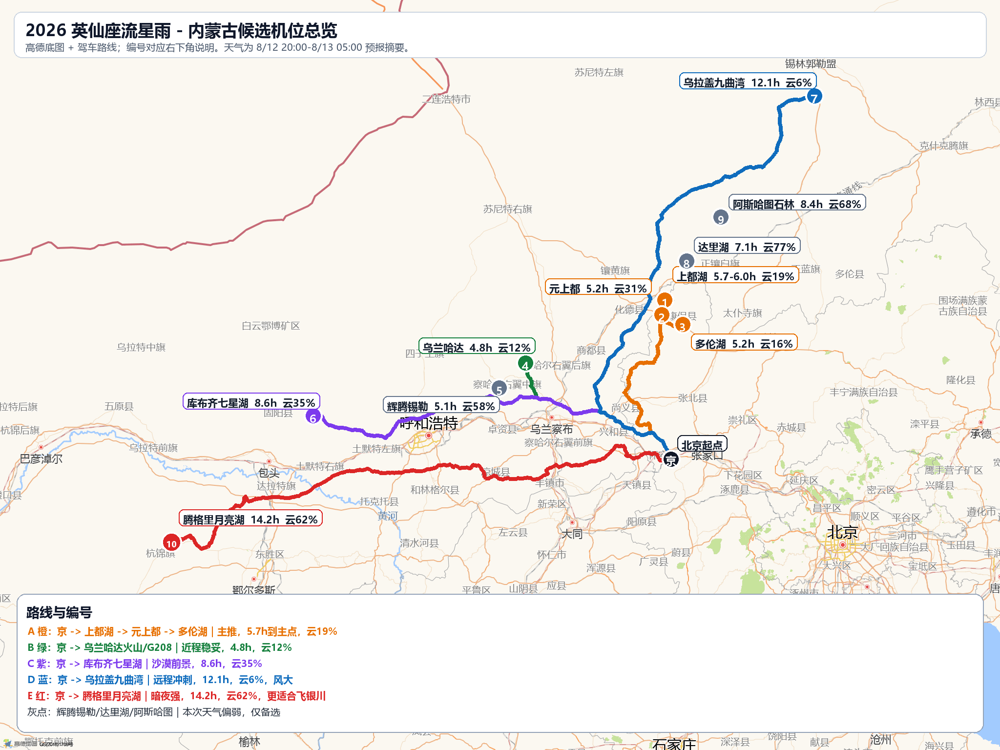
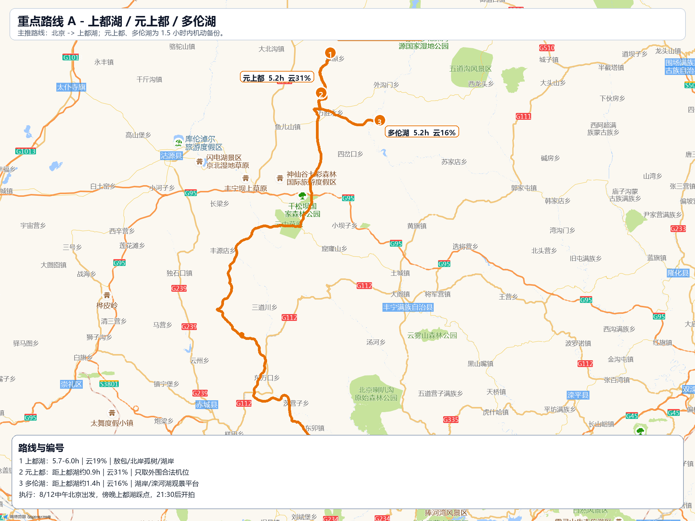
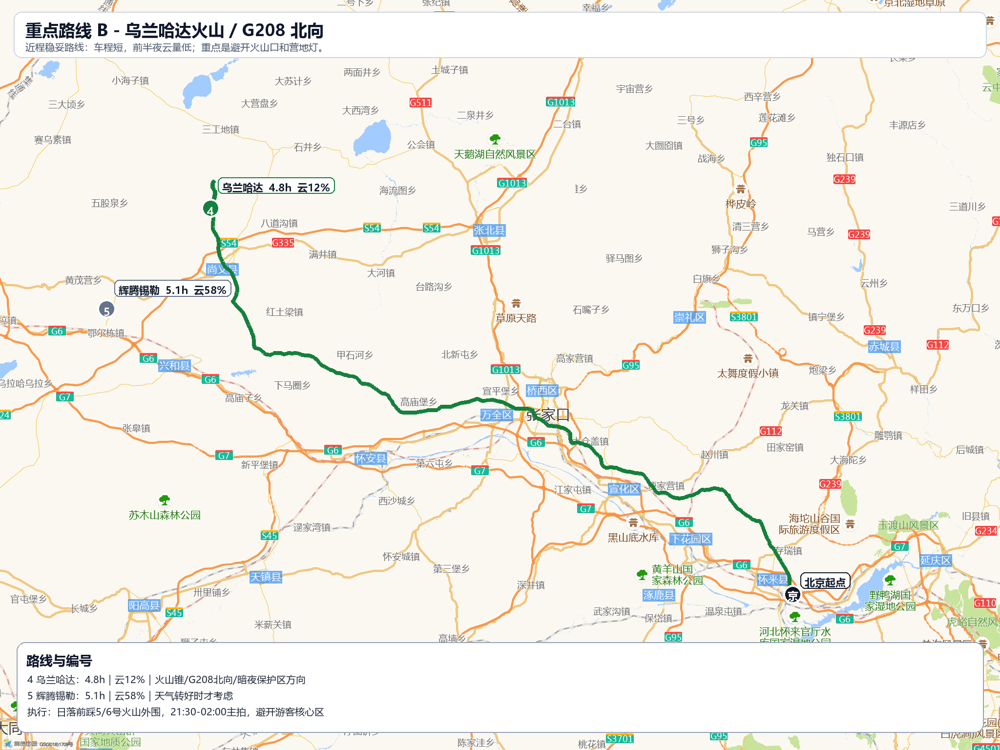

# 英仙座流星雨高德路线地图补充

更新时间：2026-08-04  
地图来源：高德静态地图 API；路线来源：高德驾车路径规划 API。  
说明：地图路线为高德 API 返回的驾车 polyline，用于出行判断和方案比较；实际导航请以出发当天高德 App 实时路况为准。

## 总览图

## 编号说明

| 编号 | 地点 | 车程 | 8/12夜天气 | 推荐 | 机位/说明 |
|---|---|---:|---|---|---|
| 1 | 上都湖 | 5.7-6.0h | 云19% | 主推 | 湖岸/敖包/孤树 |
| 2 | 元上都 | 5.2h | 云31% | 联动 | 文化遗址外围合法机位 |
| 3 | 多伦湖 | 5.2h | 云16% | 备份 | 湖岸/滦河湖观景平台 |
| 4 | 乌兰哈达 | 4.8h | 云12% | 主推 | 火山锥/G208北向 |
| 5 | 辉腾锡勒 | 5.1h | 云58% | 天气备选 | 草原/风机/山梁 |
| 6 | 库布齐七星湖 | 8.6h | 云35% | 沙漠备选 | 沙丘/孤树/07公路 |
| 7 | 乌拉盖九曲湾 | 12.1h | 云6% | 远程冲刺 | 河湾/草原/湖面 |
| 8 | 达里湖 | 7.1h | 云77% | 不建议 | 湖岸/达达线 |
| 9 | 阿斯哈图石林 | 8.4h | 云68% | 不建议 | 石林/热阿线 |
| 10 | 腾格里月亮湖 | 14.2h | 云62% | 飞银川更合理 | 沙丘/月亮湖/敖包湖 |

## 重点路线 A：上都湖 + 元上都 + 多伦湖

- 主推逻辑：上都湖是这次综合最平衡的目的地，天气窗口约云量 19%，前景有湖岸、敖包、孤树；元上都和多伦湖都在 1.5 小时机动圈内。
- 建议执行：北京中午出发，傍晚先到上都湖，日落前踩东南敖包和北岸孤树；若云量或灯光不理想，转元上都外围合法道路或多伦湖/滦河湖观景平台。

## 重点路线 B：乌兰哈达近程线

- 主推逻辑：乌兰哈达车程短，8/12 前半夜云量预报最好；但热门火山口和营地灯多，地图上建议把重点放在火山群外围、G208 北向和暗夜保护区方向。
- 建议执行：日落前踩 5/6 号火山外围和 G208 北向路边，21:30-02:00 主拍，避开游客核心区车灯。

## 远程与沙漠备选

- 库布齐七星湖：沙丘/孤树前景强，约 8.6h，但午夜后云量升高，适合作为有沙漠偏好的备选。
- 乌拉盖九曲湾：天气最好但约 12.1h，适合三天两夜冲刺，不适合疲劳硬跑。
- 腾格里月亮湖：暗夜强，但北京自驾约 14.2h，本次云量不占优；更合理是飞银川再租车。
- 达里湖/阿斯哈图：地景好，但 8/12 夜云量预报偏高，本次不建议首选。

## API 依据

- 高德静态地图 API 支持在图片地图上添加标注、标签、折线等覆盖物。
- 高德路径规划 API 以 HTTP 形式返回驾车线路、距离、预计时长和 polyline；高德官方也提示道路/数据/算法会变更，同一起终点间隔一段时间可能返回不同结果。
